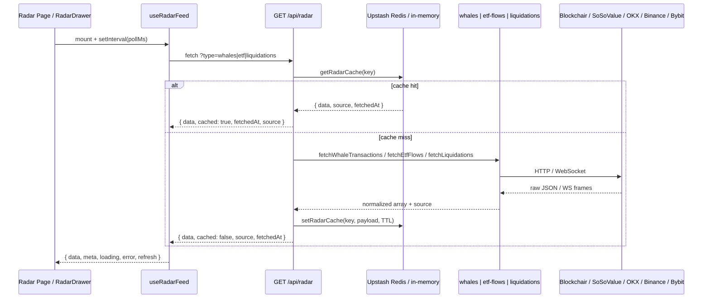

# Institutional Radar — How It Works

> **Institutional Radar** DeepCurrent ka live market-pulse section hai. Ye teen cheezein dikhata hai: **whale transactions**, **ETF activity**, aur **liquidation events** — sab external APIs se fetch hoke UI mein tables ke roop mein render hota hai.

---

## 1. Overview

User jab `/app/radar` pe jaata hai (ya landing page pe **Institutional Radar** drawer dekhta hai), to teen tabs dikhte hain:

| Tab | Kya dikhata hai | External source |
|-----|-----------------|-----------------|
| **Whales** | Bade BTC / ETH / SOL on-chain transactions | [Blockchair](https://blockchair.com/) + Solana RPC + Binance price |
| **ETF Flows** | Spot BTC/ETH ETF net flows (real) ya activity proxy (fallback) | [SoSoValue](https://sosovalue.com/developer) Demo API → fallback [Yahoo Finance](https://finance.yahoo.com/) |
| **Liquidations** | Recent futures liquidations (multi-exchange) | [OKX](https://www.okx.com/) REST + [Binance](https://developers.binance.com/) WS + [Bybit](https://bybit-exchange.github.io/) WS |

Koi database save nahi hota. Data server-side cache se serve hota hai — **Upstash Redis** (production) ya **in-memory Map** (local dev fallback).

---

## 2. Upgrade summary (July 2026)

| # | Improvement | Key change |
|---|-------------|------------|
| 1 | **Real ETF flows** | SoSoValue Demo API se actual `net_inflow`; key na ho to Yahoo proxy |
| 2 | **Multi-exchange liquidations** | OKX + Binance + Bybit merge, har row pe sahi `exchange` field |
| 3 | **Better whale detection** | BTC direction inference, Solana whales, `WHALE_THRESHOLDS` config |
| 4 | **Durable cache** | Upstash Redis (free tier); env na ho to in-memory fallback |
| 5 | **Freshness UI** | "Updated Xm ago" label, cached pill, manual refresh button per tab |

Sab optional env vars ke bina bhi feature kaam karta hai — purane behavior pe gracefully fallback hota hai.

---

## 3. Cost disclosure

| Source | Cost | Notes |
|--------|------|-------|
| SoSoValue API | Free (Demo plan) | Paid plan baad mein aa sakta hai — client `providers/sosovalue.ts` mein isolated hai, swap karna easy |
| Binance `!forceOrder@arr` WebSocket | Free | Public stream, no key |
| Bybit `allLiquidation.*` WebSocket | Free | Public, no key |
| OKX liquidation REST | Free | Public, no key |
| Blockchair | Free tier | Rate-limited |
| Solana public RPC | Free | `api.mainnet-beta.solana.com`, no key |
| Upstash Redis | Free tier | 10,000 commands/day, no credit card |

---

## 4. Environment variables

`.env.example` mein documented:

```env
# Optional — real ETF net flow data (falls back to Yahoo proxy)
SOSOVALUE_API_KEY=

# Optional — durable radar cache (falls back to in-memory)
UPSTASH_REDIS_REST_URL=
UPSTASH_REDIS_REST_TOKEN=
```

| Variable | Kahan se milega |
|----------|-----------------|
| `SOSOVALUE_API_KEY` | [sosovalue.com/developer](https://sosovalue.com/developer) — free signup |
| `UPSTASH_REDIS_REST_URL` + `UPSTASH_REDIS_REST_TOKEN` | [upstash.com](https://upstash.com) → Redis database → REST credentials |

---

## 5. End-to-end flow



---

## 6. UI locations

| Location | File | Notes |
|----------|------|-------|
| App page | `src/app/app/radar/page.tsx` | Full-page tables, 3 tabs, freshness + refresh |
| Landing drawer | `src/components/landing/RadarDrawer.tsx` | Same 3 feeds + **Scenarios** tab (static) |

Shared components:

| Component | File | Purpose |
|-----------|------|---------|
| `useRadarFeed` | `src/components/radar/useRadarFeed.ts` | Polling hook |
| `EtfSourceBadge` | `src/components/radar/EtfSourceBadge.tsx` | "Real flows" / "Estimate" pill on ETF tab |
| `RadarTabMeta` | `src/components/radar/RadarTabMeta.tsx` | "Updated Xm ago" + refresh icon |
| `whaleDirection` | `src/components/radar/whaleDirection.ts` | IN / OUT / UNKNOWN styling |

Dono jagah same hook use hota hai:

```ts
const whales = useRadarFeed<WhaleTransaction>("whales", 120_000);
const etf = useRadarFeed<ETFFlow>("etf", 300_000);
const liquidations = useRadarFeed<Liquidation>("liquidations", 30_000);
```

### UI polish (Step 5)

- Har active tab ke upar **Updated Xm ago** label (`fetchedAt` se compute)
- Cache se aaya ho to chhota **cached** pill
- Refresh icon — `refresh()` call karta hai (manual re-fetch)
- ETF tab pe **Real flows** (green) ya **Estimate** (muted) badge

---

## 7. Client hook — `useRadarFeed`

**File:** `src/components/radar/useRadarFeed.ts`

- Mount pe ek baar `GET /api/radar?type=<type>` call karta hai
- `pollMs` ke baad har interval pe dubara fetch (auto-refresh)
- Return: `{ data, loading, error, meta, refresh }`

`meta` shape:

```ts
interface RadarFeedMeta {
  source?: string;    // e.g. "sosovalue", "yahoo-proxy", "okx+binance+bybit"
  cached?: boolean;
  fetchedAt?: number; // Unix ms timestamp
}
```

| Feed | Client poll interval |
|------|---------------------|
| Whales | 120 seconds (2 min) |
| ETF Flows | 300 seconds (5 min) |
| Liquidations | 30 seconds |

Client poll aur server cache alag layers hain — client zyada baar hit kare tab bhi server cache TTL ke andar duplicate external API call nahi karta.

---

## 8. API route — `GET /api/radar`

**File:** `src/app/api/radar/route.ts`

**Query param:** `type` — `whales` | `etf` | `liquidations` | `news` (news alag feature hai, radar page pe nahi dikhta)

**Response shape:**

```json
{
  "type": "etf",
  "data": [ /* array */ ],
  "source": "sosovalue",
  "cached": false,
  "fetchedAt": 1721567890123
}
```

| type | `source` value (fresh fetch) |
|------|------------------------------|
| `whales` | `blockchair+solana-rpc` |
| `etf` | `sosovalue` ya `yahoo-proxy` |
| `liquidations` | `okx+binance+bybit` |
| `news` | `coindesk+cointelegraph+decrypt-rss` |

**Server cache TTL:**

| type | TTL | Cache key |
|------|-----|-----------|
| `whales` | 120s | `radar:whales` |
| `liquidations` | 30s | `radar:liquidations` |
| `etf` | 300s | `radar:etf` |
| `news` | 60s | `radar:news` |

Cache payload: `{ data, source }` + outer `fetchedAt` timestamp.

**Error handling:** fetch fail hone pe `503` + `{ error: "..." }`.

---

## 9. Tab 1 — Whales

**File:** `src/lib/radar/whales.ts`  
**Supporting:** `src/lib/radar/exchange-addresses.ts`  
**Source label:** `blockchair+solana-rpc`

### Thresholds (configurable)

```ts
export const WHALE_THRESHOLDS = {
  BTC: 50,       // minimum BTC per tx
  ETH: 500,      // minimum ETH per tx
  SOL: 5_000,    // minimum SOL per tx
  perChainLimit: 5,
  totalLimit: 10,
} as const;
```

### Kya fetch hota hai

Teen parallel calls (`Promise.allSettled`):

1. **Bitcoin** — `output_total ≥ 50 BTC`
   - List: `https://api.blockchair.com/bitcoin/transactions?q=output_total({minSats}..)&s=time(desc)&limit=5`
   - Direction: batch fetch `dashboards/transactions/{hashes}` → input/output addresses vs known exchange wallets
2. **Ethereum** — `value ≥ 500 ETH`
   - API: `https://api.blockchair.com/ethereum/transactions?q=value({minWei}..)&s=time(desc)&limit=5`
3. **Solana** — transfers ≥ 5,000 SOL in recent blocks
   - RPC: `https://api.mainnet-beta.solana.com` — `getSlot` + `getBlock` (last ~8 blocks)

Teeno merge hoke **max 10 rows** return hote hain.

### USD value

- BTC / ETH / SOL amount × Binance spot price (`getPrice`)
- Binance fail ho to CoinGecko fallback (`src/lib/binance.ts`)

### Direction logic

| Chain | Rule |
|-------|------|
| Bitcoin | Exchange address inputs mein hai, outputs mein nahi → `"in"` (withdrawal). Outputs mein hai, inputs mein nahi → `"out"` (deposit). Dono / koi nahi → `"unknown"` |
| Ethereum | `balance_change >= 0` → `"in"`, warna `"out"` |
| Solana | Hamesha `"unknown"` (public RPC se direction infer karna reliable nahi) |

Exchange wallet list: `src/lib/radar/exchange-addresses.ts` (`EXCHANGE_WALLET_ADDRESSES` Set).

### UI columns

Address, Chain, Amount, USD Value, Direction (green IN / red OUT / gray UNKNOWN), Time ago.

### Data type

```ts
interface WhaleTransaction {
  id: string;
  address: string;
  amount: string;
  usdValue: string;
  direction: "in" | "out" | "unknown";
  timeAgo: string;
  chain: string;  // "Bitcoin" | "Ethereum" | "Solana"
}
```

---

## 10. Tab 2 — ETF Flows

**File:** `src/lib/radar/etf-flows.ts`  
**Provider:** `src/lib/radar/providers/sosovalue.ts` (isolated, swappable)

### Primary: SoSoValue (real net flows)

`SOSOVALUE_API_KEY` set ho to:

1. BTC aur ETH ETF lists fetch: `GET /etfs?symbol=BTC|ETH&country_code=US`
2. Har ticker ke liye snapshot: `GET /etfs/{ticker}/market-snapshot` (fallback: `/history?limit=1`)
3. `net_inflow` (USD) → millions mein convert karke `netFlow` field

**Source:** `sosovalue`  
**UI:** Tab pe **Real flows** badge, column header **Net Flow ($M)**

Default tracked tickers (plus jo SoSoValue list mein extra mile):

| Ticker | Name |
|--------|------|
| IBIT | iShares Bitcoin Trust |
| FBTC | Fidelity Wise Origin Bitcoin Fund |
| GBTC | Grayscale Bitcoin Trust |
| ARKB | ARK 21Shares Bitcoin ETF |
| ETHA | iShares Ethereum Trust |

SoSoValue base URL: `https://openapi.sosovalue.com/openapi/v1`  
Header: `x-soso-api-key: YOUR_KEY`

### Fallback: Yahoo Finance proxy

Key na ho ya SoSoValue fail ho to purana proxy:

```
netFlow ($M) = (dailyVolume × price × (changePct / 100)) / 1_000_000
```

**Source:** `yahoo-proxy`  
**UI:** Tab pe **Estimate** badge, column header **Activity ($M)**

**API:** `https://query1.finance.yahoo.com/v8/finance/chart/{TICKER}?interval=1d&range=5d`

### Data type

```ts
interface ETFFlow {
  ticker: string;
  name: string;
  netFlow: number;   // signed, in millions USD
  date: string;      // trading date ya "Today"
}
```

---

## 11. Tab 3 — Liquidations (multi-exchange)

**File:** `src/lib/radar/liquidations.ts`  
**WebSocket helper:** `src/lib/radar/websocket-utils.ts`  
**Source label:** `okx+binance+bybit`

### Kya fetch hota hai

Teen sources parallel (`Promise.allSettled`):

| Exchange | Method | Pairs |
|----------|--------|-------|
| **OKX** | REST | `BTC-USDT-SWAP`, `ETH-USDT-SWAP`, `SOL-USDT-SWAP` |
| **Binance** | WebSocket ~4.5s window | `BTCUSDT`, `ETHUSDT`, `SOLUSDT` via `wss://fstream.binance.com/ws/!forceOrder@arr` |
| **Bybit** | WebSocket ~4.5s window | Same symbols via `wss://stream.bybit.com/v5/public/linear` → `allLiquidation.{symbol}` |

OKX API: `https://www.okx.com/api/v5/public/liquidation-orders?instType=SWAP&instId={pair}&state=filled&limit=20`

### Side mapping

| Exchange | Sell-side liquidation | Display |
|----------|----------------------|---------|
| OKX `side=sell` | Long closed | **long** |
| OKX `side=buy` | Short closed | **short** |
| Binance `S=SELL` | Long closed | **long** |
| Bybit `S=Sell` | Long closed | **long** |

### Amount

- OKX: `sz × bkPx` → USD
- Binance: `q × ap` (avg price) → USD
- Bybit: `v × p` → USD

Sab merge hoke recency se sort, **top 15** return. Har row ka `exchange` field sahi populate hota hai (`OKX`, `Binance`, `Bybit`).

### UI color logic

- Long liquidated → red (`text-bear`)
- Short liquidated → green (`text-bull`)

### Data type

```ts
interface Liquidation {
  id: string;
  exchange: string;   // "OKX" | "Binance" | "Bybit"
  pair: string;       // e.g. "BTC/USDT"
  side: "long" | "short";
  amount: string;
  timeAgo: string;
}
```

### Note

Binance/Bybit WebSocket sirf connect window ke dauran hone wale events capture karte hain. Quiet market mein OKX REST rows zyada dikhenge.

---

## 12. Cache layer

**File:** `src/lib/radar/utils.ts`

| Mode | Trigger | Behavior |
|------|---------|----------|
| **Upstash Redis** | `UPSTASH_REDIS_REST_URL` + `UPSTASH_REDIS_REST_TOKEN` set | REST-based Redis, TTL via `EX` option. Vercel multi-instance pe consistent |
| **In-memory Map** | Upstash env na ho | Purana behavior — process restart pe clear, per-instance cache |

```ts
getRadarCache<T>(key): Promise<{ data: T; fetchedAt: number } | null>
setRadarCache(key, data, ttlMs): Promise<void>
```

Formatters alag file mein: `src/lib/radar/format.ts` (client-safe imports ke liye).

| Function | Purpose |
|----------|---------|
| `formatTimeAgo(date)` | `"just now"`, `"5m ago"`, `"2h ago"`, `"3d ago"` |
| `formatTimeAgoFromTimestamp(ms)` | Unix ms → time ago string |
| `truncateAddress(str, chars)` | Hash shorten — `"0xabcd…ef12"` |
| `formatUsdCompact(n)` | `$1.2B`, `$450M`, `$12K` |

**File:** `src/lib/fetch-utils.ts` — HTTP calls `fetchJsonWithTimeout` se (AbortController + timeout).

---

## 13. File map

```
src/
  app/
    app/radar/page.tsx              → Institutional Radar UI (app)
    api/radar/route.ts              → Unified radar API + cache
  components/
    radar/
      useRadarFeed.ts               → Client polling hook + meta
      EtfSourceBadge.tsx            → Real flows / Estimate badge
      RadarTabMeta.tsx              → Freshness label + refresh button
      whaleDirection.ts             → IN / OUT / UNKNOWN helpers
    landing/RadarDrawer.tsx         → Landing page version
  lib/
    radar/
      whales.ts                     → Blockchair BTC/ETH + Solana RPC
      exchange-addresses.ts           → Known exchange wallets + direction inference
      etf-flows.ts                  → SoSoValue primary, Yahoo fallback
      providers/
        sosovalue.ts                → Isolated SoSoValue client (swappable)
      liquidations.ts               → OKX + Binance + Bybit
      websocket-utils.ts            → Subscribe-once WebSocket collector
      utils.ts                      → Upstash / in-memory cache
      format.ts                     → Shared formatters
      news.ts                       → News feed (radar page pe nahi)
    types.ts                        → WhaleTransaction, ETFFlow, Liquidation
    fetch-utils.ts                  → HTTP helper
    binance.ts                      → getPrice for whale USD values
```

---

## 14. Limitations (current behavior)

1. **Whales** — BTC direction best-effort hai (known exchange wallet list limited). Zyada tar BTC/SOL rows `"unknown"` dikhenge jab exchange pattern match na ho.
2. **ETF** — SoSoValue key ke bina Yahoo proxy use hota hai (estimate, real flow nahi). SoSoValue Demo plan baad mein paid ho sakta hai.
3. **Liquidations** — Binance/Bybit sirf WebSocket window (~4.5s) ke events capture karte hain; OKX historical REST data zyada reliable hai quiet markets mein.
4. **Solana whales** — Recent blocks scan karta hai, purani large txs nahi. Public RPC rate limits ho sakti hain.
5. **Cache** — Upstash free tier: 10K commands/day. Bina Redis ke multi-instance consistency nahi.
6. **Rate limits** — Blockchair free tier; `Promise.allSettled` se ek source fail ho to baaki phir bhi aate hain.
7. **No auth** — `/api/radar` public hai. Optional keys: `SOSOVALUE_API_KEY`, Upstash credentials.

---

## 15. Manual test

Dev server chalao, phir browser ya curl:

```bash
# Whales (BTC + ETH + SOL)
curl "http://localhost:3000/api/radar?type=whales"

# ETF — source "sosovalue" (key set) ya "yahoo-proxy" (fallback)
curl "http://localhost:3000/api/radar?type=etf"

# Liquidations (OKX + Binance + Bybit — ~5-10s lag sakta hai)
curl "http://localhost:3000/api/radar?type=liquidations"
```

Response mein check karo:

```json
{
  "type": "etf",
  "data": [...],
  "source": "yahoo-proxy",
  "cached": false,
  "fetchedAt": 1721567890123
}
```

UI: `http://localhost:3000/app/radar`

PowerShell:

```powershell
Invoke-RestMethod "http://localhost:3000/api/radar?type=etf" |
  Select-Object type, source, cached, fetchedAt
```

---

## 16. Related docs

- Overall project architecture: [`docs/PROJECT.md`](./PROJECT.md) — section **6.4 Radar**
- Mock data (dev/fallback, live radar se alag): `src/lib/mock-data.ts`
- Env template: `.env.example`
