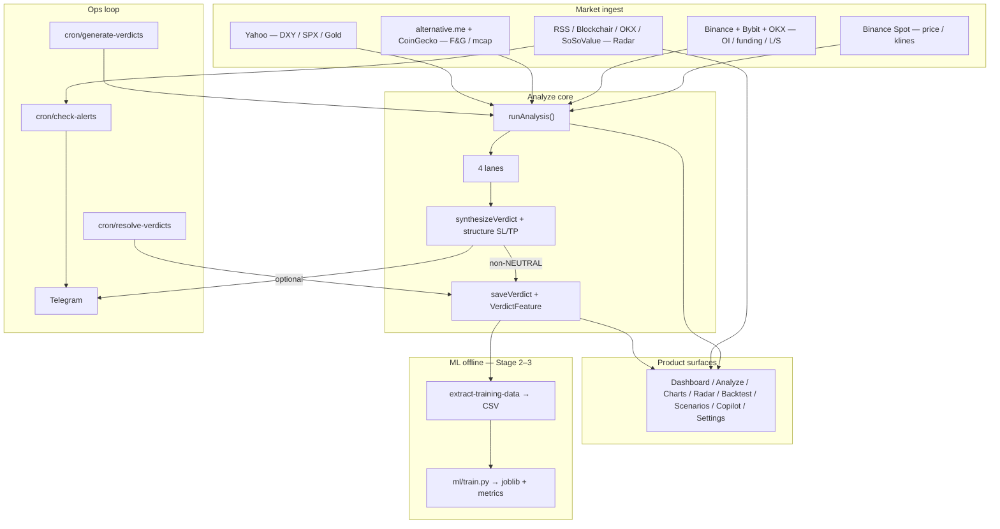
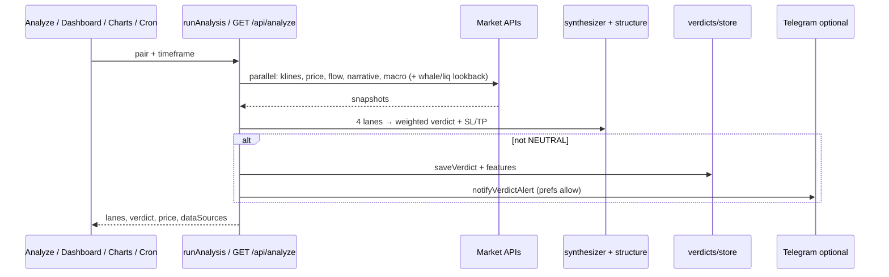
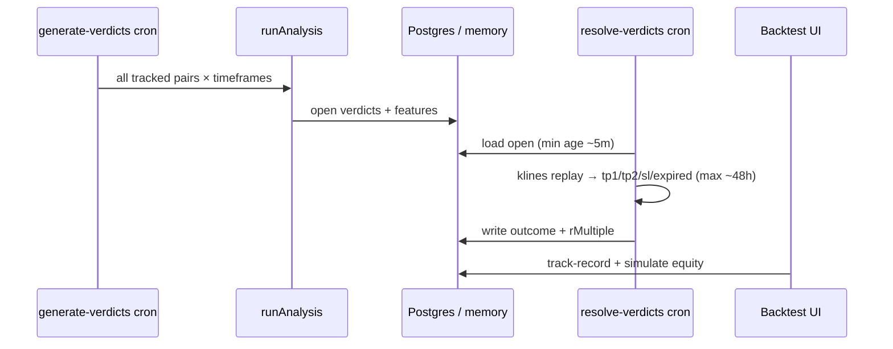
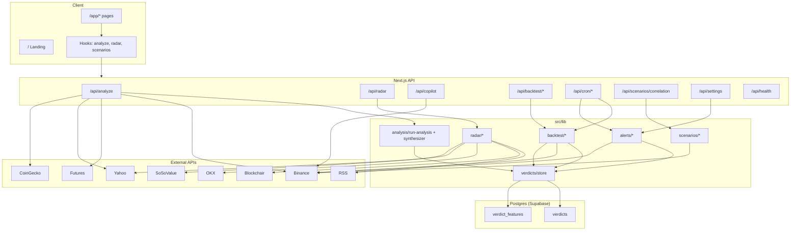

# DeepCurrent — Complete Project Documentation

> Crypto trading intelligence app. Repo / package: **deepcurrent**. UI brand: **Dheerendra Intelligence**.  
> Yeh document poora **shipped** system explain karta hai — architecture, features, data flow, APIs, ML loop, setup.

**Related:** [Institutional Radar deep-dive](./INSTITUTIONAL-RADAR.md) · [Cron scheduling](./CRON.md)

---

## 0. Short summary (Hinglish)

DeepCurrent ek **Next.js** web app hai jo traders ko sirf chart nahi dikhata — **market move ke peeche ka cause** batata hai.

**Poora live loop (jo ab tak wired hai):**

1. Char independent lanes → Technical, Flow, Narrative, Macro  
2. Weighted synthesis → **Verdict** (LONG / SHORT / NEUTRAL + SL/TP)  
3. Non-neutral → Postgres mein save (+ point-in-time features, inkl. whale/liq)  
4. Cron resolve → outcomes (`tp1_hit` / `tp2_hit` / `sl_hit` / `expired`)  
5. Backtest track-record + equity simulator; optional Telegram alerts  
6. Offline ML: features → CSV extract → baseline train (`ml/models/`) — **live inference abhi nahi**

Saath mein: Radar (whales / ETF / liquidations / news / events), Scenarios, Copilot (Gemini preferred).

**Disclaimer:** Informational tool only — financial advice nahi. Pricing / paywall / tokens nahi. SEC filings / scrape pipeline nahi.

---

## 1. Project kya hai?

### Problem

Traders usually alag-alag sources pe depend karte hain: chart indicators, futures positioning, news/sentiment, macro (DXY/SPX/Gold). Inko manually jodna mushkil hai.

### Solution

DeepCurrent ek hi pipeline mein sab jodta hai:

| Layer | Kya milta hai | Status |
|-------|----------------|--------|
| **Analyze / Charts / Dashboard** | 4-lane analysis + synthesized trade idea | Shipped |
| **Radar** | Institutional pulse — whales, ETF flows, liquidations (+ news/events on Dashboard) | Shipped |
| **Backtest** | Verdicts save → resolve → win rate / equity simulator | Shipped |
| **Alerts** | Verdict + radar-spike → Telegram | Shipped |
| **Scenarios** | “Agar BTC −10%?” portfolio stress test | Shipped |
| **Copilot** | Chat + live price + LLM (Gemini / Anthropic) + template fallback | Shipped |
| **ML (offline)** | Feature capture → CSV → baseline classifier train | Stage 2–3 done; Stage 4 inference **not wired** |

### Stack

| Layer | Tech |
|--------|------|
| Framework | Next.js **16.2** (App Router) |
| UI | React **19**, Tailwind CSS **4**, Framer Motion, Lucide |
| Charts | `lightweight-charts` (candles), Recharts (equity curve) |
| 3D (landing) | Three.js |
| Database | PostgreSQL (Supabase) via **Prisma 7** + `@prisma/adapter-pg` |
| Optional cache | Upstash Redis (radar + alert prefs) |
| ML (offline) | Python — HistGradientBoosting (`ml/train.py`) |
| Language | TypeScript |
| Deploy | Vercel (`vercel.json` daily cron fallback + GitHub Actions / cron-job.org for frequent runs) |

**Scripts:** `dev`, `build`, `start`, `lint`, `db:generate`, `db:migrate`, `db:push`, `db:studio`, `extract-training-data`, `train-model`.

---

## 2. Complete system flow (end-to-end)

Yeh woh loop hai jo **aaj production path mein chalta hai**:



### Lifecycle — Analyze (product ka heart)



### Lifecycle — Track record



### Lifecycle — ML (offline only)

| Stage | Kya | Status |
|-------|-----|--------|
| **1 — Capture** | Analyze time pe `VerdictFeature` (lanes + whale/liq + meta) | Done — live |
| **2 — Extract** | `npm run extract-training-data` → `ml/data/training_dataset.csv` | Done |
| **3 — Train** | `npm run train-model` / `python ml/train.py` → `ml/models/` | Done (baseline) |
| **4 — Inference** | Live `synthesizeVerdict` mein model score | **Not wired** |

Artifacts (`ml/data/`, `ml/models/`) local hain — **gitignored**. Baseline metrics weak edge dikhate hain; product gate nahi.

---

## 3. High-level architecture



---

## 4. Folder structure

```
prisma/
  schema.prisma              → Verdict + VerdictFeature
  migrations/                → init + momentum/ROC + whale/liq features
prisma.config.ts             → Prisma v7 CLI (DIRECT_URL for migrations)
vercel.json                  → Daily Vercel cron fallback
.github/workflows/
  frequent-cron.yml          → Primary frequent cron (resolve / generate / alerts)
.env.example                 → Env templates

src/
  generated/prisma/          → Generated Prisma client (do not edit)
  app/
    page.tsx                 → Marketing landing
    layout.tsx               → Root layout (fonts, metadata)
    auth/login|signup        → Mock auth
    privacy|terms            → Legal
    app/                     → Product shell (AppShell)
      dashboard|analyze|charts|backtest|copilot|radar|scenarios|settings
    api/                     → Route handlers
  components/
    landing/                 → Homepage sections (+ Three.js globe)
    app/AppShell.tsx         → Sidebar nav
    charts/                  → Live candles + VerdictCard
    backtest/                → Simulator UI
    scenarios/               → Stress test UI
    radar/                   → useRadarFeed + meta UI
    ui/                      → GlassCard, BiasPill, TierPill, BrandLogo, …
  hooks/
    useLiveAnalysis.ts
    useCorrelationMatrix.ts
  lib/
    analysis/                → run-analysis, 4 lanes, synthesis, structure
    backtest/                → Resolve, simulate, track record, lane weights
    radar/                   → News, whales, liquidations, ETF, events
    alerts/                  → Engine, Telegram notify, prefs
    flow/                    → Multi-exchange OI/funding aggregate
    nlp/                     → Headline sentiment
    verdicts/                → Verdict store + ML feature capture
    scenarios/               → Portfolio stress + correlation
    market/constants.ts      → Tracked pairs + timeframes
    db.ts                    → Lazy Prisma + pg adapter
    binance.ts / binance-futures.ts / macro.ts / narrative.ts
    tradingview.ts           → Chart helpers / pair prefs
    types.ts                 → Shared domain types
  scripts/                   → extract-training-data, debug helpers

ml/
  train.py                   → Stage 3 baseline classifier
  requirements.txt
  data/                      → CSVs (gitignored, local)
  models/                    → joblib + metrics (gitignored, local)

docs/
  PROJECT.md                 → Yeh file
  INSTITUTIONAL-RADAR.md     → Radar deep dive
  CRON.md                    → Frequent cron setup
```

Path alias: `@/*` → `./src/*`.

---

## 5. Routes & pages

### Public

| Route | File | Purpose |
|-------|------|---------|
| `/` | `src/app/page.tsx` | Marketing: Hero → EarthRadar → Pipeline → Synthesis → Delivery → CopilotMock → RadarDrawer → ScenarioSimulator → FinalCTA → Footer |
| `/auth/login` | `src/app/auth/login/page.tsx` | Mock sign-in → `/app/dashboard` |
| `/auth/signup` | `src/app/auth/signup/page.tsx` | Mock signup → `/app/dashboard` |
| `/privacy` | `src/app/privacy/page.tsx` | Privacy policy |
| `/terms` | `src/app/terms/page.tsx` | Terms of service |

Root layout (`src/app/layout.tsx`): Inter + JetBrains Mono, dark theme, title **Dheerendra Intelligence**.

### App (`/app/*`)

Wrapped by `src/app/app/layout.tsx` → `AppShell` sidebar (`src/components/app/AppShell.tsx`).

| Route | Purpose |
|-------|---------|
| `/app/dashboard` | Live prices, multi-pair verdicts, **news + calendar events** |
| `/app/analyze` | Manual 4-lane pipeline runner |
| `/app/charts` | Live candles + side verdict card |
| `/app/backtest` | Track record + equity simulator |
| `/app/copilot` | Chat UI (Gemini / Claude / template fallback) |
| `/app/radar` | Whales / ETF / liquidations tables |
| `/app/scenarios` | BTC shock portfolio stress test |
| `/app/settings` | Telegram + alert prefs via `/api/settings` |

**Nav order:** Dashboard → Analyze → Charts → Backtest → Copilot → Radar → Scenarios → Settings.

**Auth note:** `/app/*` **ungated** — no `middleware.ts`. Login/signup sirf `localStorage` stub.

---

## 6. Core engine — 4 Lanes → 1 Verdict

Yeh product ka heart hai. Entry: **`GET /api/analyze`** (shared: `src/lib/analysis/run-analysis.ts`).

**Files:**
- `src/app/api/analyze/route.ts`
- `src/lib/analysis/run-analysis.ts`
- `src/lib/analysis/synthesizer.ts`
- `src/lib/analysis/structure.ts`
- `src/lib/backtest/lane-weights.ts`

### End-to-end flow

1. Client / cron: pair + timeframe  
2. Parallel fetch:
   - Binance klines (200 bars) + spot price  
   - Binance Futures + Bybit + OKX flow metrics  
   - Narrative snapshot  
   - Macro snapshot  
   - Whale / liquidation lookback (~2h) for feature capture (BTC/ETH/SOL whales; BNB/XRP whale fields null)  
3. Char lane runners execute  
4. `synthesizeVerdict()` weighted score → direction + tier  
5. Structure / ATR → SL, TP1, TP2  
6. Agar direction `NEUTRAL` nahi → `saveVerdict()` + point-in-time features + cache invalidate + optional Telegram  
7. JSON: `{ lanes, verdict, price, dataSources }`

### Lane 1 — Technical (`runTechnicalLane`)

| Item | Detail |
|------|--------|
| Data | Candle closes, highs, lows |
| Signals | EMA50, EMA200, RSI(14), swing levels |
| Bias | Price > EMA50 > EMA200 → BULL; opposite → BEAR; mixed otherwise |
| Output | `LaneOutput` with reasoning bullets |

### Lane 2 — Flow (`runFlowLane`)

| Item | Detail |
|------|--------|
| Data | Futures OI Δ%, funding rate, long/short ratio (+ 24h price change) across **Binance + Bybit + OKX** |
| Source | `src/lib/flow/aggregate.ts` → `getFlowMetrics` |
| Note | % metrics averaged; absolute OI prefers Binance; missing venues degrade gracefully |

### Lane 3 — Narrative (`runNarrativeLane`)

| Item | Detail |
|------|--------|
| Data | Fear & Greed, global mcap Δ, 24h price/volume, trending coins |
| Source | `src/lib/narrative.ts` — alternative.me + CoinGecko + Binance |

### Lane 4 — Macro (`runMacroLane`)

| Item | Detail |
|------|--------|
| Data | DXY, S&P 500, Gold daily % |
| Source | `src/lib/macro.ts` — Yahoo Finance |

### Synthesis (`synthesizeVerdict`)

```
laneScore = BIAS_SCORE[bias] × TIER_SCORE[tier]

BIAS:  BULL = +1, BEAR = -1, MIXED = 0
TIER:  HIGH = 3, MODERATE = 2, LOW = 1
```

Weighted average (dynamic lane weights se):

```
normalized = Σ(laneScore × weight) / Σ(weight)
```

| Normalized | Direction | Tier |
|------------|-----------|------|
| `> 0.8` | LONG | HIGH only if `> 1.5` **and** ≥3 BULL lanes **and** Narrative ≠ BEAR; else MODERATE |
| `< -0.8` | SHORT | HIGH only if `< -1.5` **and** ≥3 BEAR lanes **and** Narrative ≠ BULL; else MODERATE |
| otherwise | NEUTRAL | MODERATE |

Score-alone HIGH was too easy (e.g. equal-weight 4× MODERATE → `2.0`) and produced weak / conflicting “HIGH” labels.

**Default lane weights** (jab tak ≥30 resolved trades na hoon):

| Lane | Weight |
|------|--------|
| Technical | 0.30 |
| Flow | 0.25 |
| Narrative | 0.25 |
| Macro | 0.20 |

Enough history ke baad weights historical lane accuracy se adjust hote hain.

**Levels** (`structure.ts`):
- ~20-bar swing high/low
- SL structure-anchored, ATR clamp (~0.8×–2.5× ATR)
- TP1 ≈ 2R, TP2 ≈ 3.5R
- Entry = current price
- `riskReward` string e.g. `1:2.0`

**Tracked pairs** (`src/lib/market/constants.ts`): BTC, ETH, SOL, BNB, XRP (USDT).  
**Timeframes:** `15m`, `30m`, `1h`, `4h`, `1d`.  
**Dashboard subset:** BTC, ETH, SOL, BNB.  
*(PAXG dropped from auto-track — no OKX Flow fallback on Vercel; Copilot can still answer manual PAXG questions.)*

---

## 7. Features — detail

### 7.1 Dashboard (`/app/dashboard`)

- Tracked pairs ke live prices (`/api/market`)
- Multi-pair analyze / open verdicts overview
- **News feed** (`/api/radar?type=news`)
- **Calendar events** (`/api/radar?type=events` — Binance CMS + CoinPaprika)
- Quick market + signal snapshot

### 7.2 Analyze (`/app/analyze`)

- User pair + timeframe select karta hai
- Hook: `useLiveAnalysis` → `GET /api/analyze`
- 4 lane cards + final Verdict card
- Same analyze flow Charts ke `VerdictCard` mein reuse

### 7.3 Charts (`/app/charts`)

- `LiveCandleChart`: pehle REST `/api/klines`, phir Binance WebSocket live updates
- Side pe live verdict + price poll
- Selected pair: `localStorage` key `dc_selected_pair` (`tradingview.ts`)

### 7.4 Radar (`/app/radar` + landing drawer)

**Full detail:** [`docs/INSTITUTIONAL-RADAR.md`](./INSTITUTIONAL-RADAR.md)

**API:** `GET /api/radar?type=news|whales|liquidations|etf|events`

Response: `{ type, data, source, cached, fetchedAt }`.

| Type | Source | Cache TTL | UI |
|------|--------|-----------|-----|
| `news` | CoinDesk / CoinTelegraph / Decrypt RSS + keyword sentiment | ~60s | Dashboard (+ landing) |
| `whales` | Blockchair BTC/ETH + Solana RPC (size thresholds) | ~120s | `/app/radar` |
| `liquidations` | OKX REST + Binance/Bybit WebSocket (BTC/ETH/SOL) | ~30s | `/app/radar` |
| `etf` | SoSoValue real net flows (`SOSOVALUE_API_KEY`) → fallback Yahoo proxy | ~300s | `/app/radar` |
| `events` | Binance CMS + CoinPaprika calendar | short TTL | Dashboard |

Cache: Upstash Redis (optional) ya in-memory fallback.

Hook: `src/components/radar/useRadarFeed.ts`.  
Libs: `src/lib/radar/` — `news.ts`, `whales.ts`, `etf-flows.ts`, `liquidations.ts`, `events.ts`, `providers/sosovalue.ts`, `utils.ts`, `format.ts`.

Koi Radar DB table nahi — live fetch + cache only. SEC filings / scrape **nahi**.

### 7.5 Backtest (`/app/backtest`)

Teen-step pipeline:

1. **Persist** — non-neutral analyze verdicts → Postgres (ya memory) + `verdict_features`
   - Manual: user visits `/app/analyze`
   - Auto: cron `GET|POST /api/cron/generate-verdicts` (all tracked pairs × timeframes)
2. **Resolve** — cron `GET|POST /api/cron/resolve-verdicts`
   - Open verdicts pe klines replay
   - Outcomes: `tp1_hit` / `tp2_hit` / `sl_hit` / `expired`
   - Min age ~5m, max hold ~48h
   - Optional auth: `Authorization: Bearer CRON_SECRET`
3. **Report**
   - `GET /api/backtest/track-record` → win rate, tier WR, lane accuracy
   - `POST /api/backtest/simulate` → capital, risk%, date range → equity curve + trades

**Cron schedules (dual setup — do not assume Vercel alone is enough):**
- **Primary (frequent):** GitHub Actions / cron-job.org → resolve every 15m, generate every 3h, alerts every 10–15m
- **Fallback (Hobby daily only):** `vercel.json` → resolve `0 0 * * *`, generate `0 1 * * *`, alerts `0 2 * * *`
- See [`docs/CRON.md`](./CRON.md). Both paths are idempotent.

**Libs:** `simulator.ts`, `resolver.ts`, `aggregator.ts`, `cache.ts`, `lane-weights.ts`  
**UI:** `TrackRecordSummary`, `SimulatorPanel`, `EquityCurveChart`  
**Minimum trades:** `MIN_SIM_TRADES` (5)

**Caveat:** Bina `DATABASE_URL` ke verdict store **process memory** hai — restart pe data lose. Postgres set hone par durable.

### 7.6 ML pipeline (offline)

| Step | Command | Output |
|------|---------|--------|
| Extract | `npm run extract-training-data` | `ml/data/training_dataset.csv` (+ preview) |
| Train | `pip install -r ml/requirements.txt` then `npm run train-model` | `ml/models/baseline_classifier.joblib`, `baseline_metrics.json`, `feature_importance.csv` |

- Features: technical / flow / narrative / macro + whale/liq + meta (tier, lane agreement, hour/day)
- Model: HistGradientBoostingClassifier, time-ordered walk-forward
- **Live analyze path model score use nahi karta** — Stage 4 pending

### 7.7 Scenarios (`/app/scenarios`)

1. Positions `localStorage` (`dc_portfolio_positions`) mein
2. Mark prices `/api/market` se refresh
3. Correlation: Binance 1h klines, Pearson β vs BTC (`/api/scenarios/correlation`)
4. User BTC shock % set karta hai
5. `stressPortfolio()` → shocked price, PnL, stop-hit, funding/OI cascade
6. Optional: open verdicts import → risk-sized positions (`verdict-import.ts`)

**Libs:** `stress.ts`, `correlation.ts`, `positions-store.ts`, `mark-prices.ts`, `verdict-import.ts`  
**Hook:** `useScenarioPortfolio`  
**UI:** `ScenarioStressPanel`, `PositionControls`

### 7.8 Copilot (`/app/copilot`)

- Model dropdown maps to Gemini (default) / Anthropic Claude
- `POST /api/copilot` `{ message, model? }`
- Message se symbol extract (BTC/ETH/SOL/BNB/XRP/PAXG, default BTC)
- Live price + 24h ticker + open verdicts + news headlines as context
- `GEMINI_API_KEY` (free, preferred) ya `ANTHROPIC_API_KEY` → real LLM; warna **template fallback**
- Default model: Gemini 2.5 Flash

### 7.9 Settings & Alerts (`/app/settings`)

- Telegram chat id + test alert (`POST /api/settings/test-telegram`)
- Alert prefs: enabled, minTier, watchlist, radar spike toggles
- Persisted via `GET/PUT /api/settings` (Upstash Redis or in-memory) — **server prefs**, not client-only
- Env fallbacks: `TELEGRAM_BOT_TOKEN`, `TELEGRAM_CHAT_ID`
- Immediate verdict alert: non-NEUTRAL analyze → `notifyVerdictAlert`
- Periodic radar spikes: `GET|POST /api/cron/check-alerts`

**Libs:** `src/lib/alerts/` — engine, notify, telegram, prefs.

### 7.10 Auth — mock

- Login/signup: `localStorage.setItem("dc_auth", JSON.stringify({ email }))`
- Password validate / store nahi hota
- **No** `middleware.ts`, sessions, cookies, DB User model
- `/app/*` routes **ungated** hain
- Sign out = link to `/auth/login` (AppShell `dc_auth` clear nahi karta)

---

## 8. API reference

| Method | Path | Input | Output / role |
|--------|------|-------|----------------|
| GET | `/api/analyze` | `pair`, `timeframe` | `{ lanes, verdict, price, dataSources }` |
| GET | `/api/market` | `symbol` | `{ symbol, price }` |
| GET | `/api/klines` | `symbol`, `interval`, `limit` (max 500) | `{ candles: [{ time, open, high, low, close }] }` |
| POST | `/api/copilot` | `{ message, model? }` | `{ reply, symbol, price }` |
| GET | `/api/radar` | `type` = news\|whales\|liquidations\|etf\|events | `{ type, data, source, cached, fetchedAt }` |
| POST | `/api/backtest/simulate` | pair, dateRange, capital, risk, minTier… | Equity curve + trades + metrics |
| GET | `/api/backtest/track-record` | — | Aggregate WR, lane accuracy, etc. |
| GET | `/api/scenarios/correlation` | — | `{ matrix, cached, source }` |
| GET | `/api/verdicts/open` | — | `{ verdicts, count }` |
| GET/POST | `/api/cron/resolve-verdicts` | Bearer secret (optional) | Resolve open verdicts |
| GET/POST | `/api/cron/generate-verdicts` | Bearer secret (optional) | Auto-analyze all tracked pairs × TFs |
| GET/POST | `/api/cron/check-alerts` | Bearer secret (optional) | Radar spike → Telegram |
| GET/PUT | `/api/settings` | prefs JSON | Alert preferences |
| POST | `/api/settings/test-telegram` | — | Send test Telegram message |
| GET | `/api/health` | — | DB / backtest / env presence snapshot |

### Analyze `dataSources` example

```ts
{
  klines: "binance",
  price: "binance",
  flow: "binance+bybit+okx" | "binance" | "unavailable",
  narrative: "alternative.me+coingecko+binance" | "unavailable",
  macro: "yahoo-finance" | "unavailable",
  stopLoss: "swing-structure",
}
```

---

## 9. Key hooks

| Hook | File | Behavior |
|------|------|----------|
| `useLiveAnalysis(pair, timeframe)` | `src/hooks/useLiveAnalysis.ts` | Fetches `/api/analyze` once per pair/TF |
| `useRadarFeed(type, pollMs)` | `src/components/radar/useRadarFeed.ts` | Polls `/api/radar` |
| `useCorrelationMatrix()` | `src/hooks/useCorrelationMatrix.ts` | One-shot correlation fetch |
| `useScenarioPortfolio(enabled)` | `src/components/scenarios/useScenarioPortfolio.ts` | Hydrate/persist positions, marks, import verdicts |

---

## 10. External data sources

| Source | Used for |
|--------|----------|
| Binance Spot REST | Price, klines, 24h ticker |
| Binance WebSocket | Live chart candles |
| Binance Futures | OI, funding, long/short (primary flow venue) |
| Bybit / OKX | Additional OI + funding (+ L/S) averaged into Flow lane |
| CoinGecko | Price fallback; narrative global/trending |
| alternative.me | Fear & Greed index |
| Yahoo Finance | Macro (DXY / SPX / Gold); ETF activity proxy |
| CoinDesk / CoinTelegraph / Decrypt RSS | News headlines |
| Blockchair (+ helpers) | Whale transactions |
| Solana public RPC | SOL whales |
| OKX / Binance / Bybit | Liquidations |
| SoSoValue OpenAPI | Real ETF net flows (optional key) |
| Binance CMS / CoinPaprika | Calendar events |
| Upstash Redis | Durable radar cache + alert prefs (optional) |
| Google AI (Gemini) / Anthropic | Copilot LLM |

### Environment variables

| Variable | Role |
|----------|------|
| `DATABASE_URL` | App runtime Postgres (Supabase transaction pooler, typically port **6543**) |
| `DIRECT_URL` | Prisma migrations (session pooler, typically port **5432**) |
| `CRON_SECRET` | Optional bearer auth for cron routes |
| `SOSOVALUE_API_KEY` | Real ETF net flows |
| `UPSTASH_REDIS_REST_URL` / `UPSTASH_REDIS_REST_TOKEN` | Radar cache + alert prefs |
| `GEMINI_API_KEY` | Free Copilot LLM via Google AI Studio (preferred) |
| `ANTHROPIC_API_KEY` | Paid Copilot LLM fallback (Claude) |
| `TELEGRAM_BOT_TOKEN` | Telegram Bot API token for alerts |
| `TELEGRAM_CHAT_ID` | Default chat id (Settings can override) |

Templates: `.env.example`.

---

## 11. Storage map

| Data | Where | Durable? |
|------|--------|----------|
| Verdicts / backtest history | Postgres via Prisma when `DATABASE_URL` set; else in-memory | Yes with DB; no without |
| Point-in-time lane features | `verdict_features` (or memory) | Same as verdicts |
| Radar / track-record caches | Upstash or in-memory Map + TTL | Redis yes / memory no |
| Alert prefs | Upstash / in-memory (`alerts:prefs`) | Redis yes / memory no |
| Auth stub | `localStorage` `dc_auth` | Browser only |
| Chart pair | `localStorage` `dc_selected_pair` | Browser |
| Scenario portfolio | `localStorage` `dc_portfolio_positions` | Browser |
| ML CSV / models | `ml/data/`, `ml/models/` (gitignored) | Local disk only |

### Database schema (Prisma)

| Model / table | Purpose |
|---------------|---------|
| `Verdict` → `verdicts` | Trade idea: pair, direction, tier, entry/SL/TP, lane biases, outcome |
| `VerdictFeature` → `verdict_features` | Point-in-time raw lane numerics + whale/liq + meta (ML); 1:1 with verdict |

**Feature groups on `VerdictFeature`:** technical (EMA/RSI/ATR regime…), flow (OI/funding/ROC…), narrative (F&G…), macro (DXY/SPX/Gold), whale/liq lookback USD fields, meta (tier, lane agreement, hour/day).

**Runtime:** `src/lib/db.ts` → lazy `PrismaClient` + `PrismaPg` on `DATABASE_URL`.  
**Store:** `src/lib/verdicts/store.ts` — `"postgres"` | `"memory"` via `getVerdictStoreMode()`.  
**Outcomes:** `tp1_hit` | `tp2_hit` | `sl_hit` | `expired` | `open`.

Migrations:
- `init_verdicts`
- `add_momentum_roc_features`
- `add_whale_liquidation_features`

---

## 12. Domain types

Shared in `src/lib/types.ts`:

| Type | Role |
|------|------|
| `Bias` | `BULL` \| `BEAR` \| `MIXED` |
| `Tier` | `HIGH` \| `MODERATE` \| `LOW` |
| `Direction` | `LONG` \| `SHORT` \| `NEUTRAL` |
| `LaneOutput` | Lane result: badge, bias, tier, reasoning |
| `Verdict` | Final trade idea: levels, R:R, rationale |
| Radar DTOs | `NewsItem`, `WhaleTransaction`, `ETFFlow`, `Liquidation` |
| Scenario DTOs | `PortfolioPosition`, `PositionStressResult`, `PortfolioStressResult` |

Persisted: `StoredVerdict`, feature payloads in `src/lib/verdicts/`.

---

## 13. UI / design system

### Theme (`src/app/globals.css`)

Dark navy palette via CSS variables → Tailwind `@theme`:

| Token | Role |
|-------|------|
| `--bg-primary` `#03060f` | Page background |
| `--bg-secondary` `#080c1a` | Shell / panels |
| `--bg-card` `#0d1224` | Cards |
| `--bull` / `--bear` / `--mixed` / `--accent` | Signal colors |
| Fonts | Inter (sans), JetBrains Mono (data) |

Utilities: `.glass-card`, glow / pulse helpers.

### Shared components

| Area | Components |
|------|------------|
| Shell | `AppShell`, `BrandLogo` |
| Charts | `LiveCandleChart`, `VerdictCard` |
| Backtest | `TrackRecordSummary`, `SimulatorPanel`, `EquityCurveChart` |
| Scenarios | `ScenarioStressPanel`, `PositionControls` |
| Shared UI | `GlassCard`, `BiasPill`, `TierPill`, `CoinIcon`, `ScrollReveal` |
| Landing | `Hero`, `EarthRadar`/`GlobeScene`, `Pipeline`, `Synthesis`, `Delivery`, `CopilotMock`, `RadarDrawer`, `ScenarioSimulator`, `FinalCTA`, `Footer`, `ProgressRail` |

No shadcn / Redux — domain logic `src/lib/` mein, UI `src/components/` mein.

---

## 14. Local development

```bash
npm install
cp .env.example .env          # fill DATABASE_URL + DIRECT_URL (Supabase)
npm run db:migrate            # apply Prisma migrations (uses DIRECT_URL)
npm run dev                   # http://localhost:3000
```

| Script | Purpose |
|--------|---------|
| `npm run db:generate` | Regenerate Prisma client → `src/generated/prisma` |
| `npm run db:migrate` | Create / apply migrations |
| `npm run db:push` | Push schema without migration file |
| `npm run db:studio` | Browse tables in browser |
| `npm run extract-training-data` | ML CSV from resolved verdicts |
| `npm run train-model` | Train baseline classifier (`python ml/train.py`) |
| `npm run build` | `prisma generate && next build` |
| `npm run lint` | ESLint |

**Supabase + Prisma v7:**
- Runtime: `DATABASE_URL` (6543, pgbouncer) in `src/lib/db.ts`
- CLI: `DIRECT_URL` (5432) via `prisma.config.ts` — sirf 6543 se migrations hang ho sakti hain

Bina real `DATABASE_URL` ke app chalega; verdicts memory mein rahenge (restart pe lose).

**Check paths:** `/` · `/app/dashboard` · `/app/analyze` · `/app/charts` · `/app/radar` · `/app/backtest` · `/app/scenarios` · `/app/copilot` · `/app/settings`

---

## 15. Shipped vs not yet

### Shipped (wired & usable)

- 4-lane analyze + synthesis + structure SL/TP  
- Multi-venue flow aggregation (Binance + Bybit + OKX)  
- Persist verdicts + features (Postgres or memory), inkl. whale/liq features  
- Cron generate / resolve / check-alerts (+ GHA workflow)  
- Backtest track record + equity simulate + dynamic lane weights  
- Institutional Radar (whales / ETF / liq) + news + events APIs  
- Dashboard news/events; Radar page three tabs  
- Scenarios stress + correlation  
- Copilot Gemini/Claude + template fallback  
- Settings alert prefs + Telegram (verdict + radar)  
- Health endpoint  
- Offline ML Stage 2 extract + Stage 3 train  

### Not yet / intentional gaps

| Item | Reality |
|------|---------|
| **ML Stage 4 — live inference** | Train-only; scores do not affect `synthesizeVerdict` |
| **Real auth / user accounts** | Mock `localStorage` only |
| **SEC filings / scrape pipelines** | Absent by design so far |
| **Radar News/Events tabs on `/app/radar`** | API exists; UI on Dashboard |
| **Paywall / multi-tenant** | None |
| **Strong ML edge** | Baseline trained; metrics weak; not a product gate |
| **Durable everything without env** | Without DB/Redis, history/prefs ephemeral |
| **ETF real flows without SoSoValue key** | Yahoo **proxy** only |
| **Whale features for BNB/XRP** | Intentionally null (no chain map) |

---

## 16. Known limitations

1. **Auth is mock** — routes unprotected; no User table / sessions (intentional for solo use)
2. **Copilot needs `GEMINI_API_KEY` (free) or `ANTHROPIC_API_KEY`** — without either, keyword templates still work
3. **Memory fallback without DB / Redis** — backtest history + alert prefs ephemeral on restart
4. **ETF flows** — SoSoValue jab key ho; warna Yahoo **proxy**, issuer flow data nahi  
5. **Branding mix** — package `deepcurrent`, UI “Dheerendra Intelligence”  
6. **Supabase dual URL** — runtime 6543 vs migrate 5432  
7. **Cron** — Vercel pe **daily** fallback; dense schedule via GitHub Actions / cron-job.org (`docs/CRON.md`)  
8. **Telegram** — needs bot token + chat id; no BotFather deep-link OAuth flow  
9. **ML** — offline baseline only; not in live verdict path  

---

## 17. Quick map — “kaunsi functionality kahan”

| User goal | UI | API | Lib |
|-----------|-----|-----|-----|
| 4-lane signal | Analyze / Charts / Dashboard | `/api/analyze` | `analysis/run-analysis`, `synthesizer` |
| Live candles | Charts | `/api/klines` + Binance WS | `binance`, `tradingview` |
| Market pulse | Radar / Dashboard | `/api/radar` | `radar/*` |
| Historical edge | Backtest | `/api/backtest/*` + cron | `backtest/*`, `verdicts/*` |
| “Agar BTC −10%?” | Scenarios | `/api/scenarios/correlation`, `/api/market` | `scenarios/*` |
| Ask a question | Copilot | `/api/copilot` | Gemini / Anthropic + template fallback |
| Alerts | Settings | `/api/settings`, `/api/cron/check-alerts` | `alerts/*` + Telegram |
| Train ML offline | CLI | — | `scripts/extract-training-data`, `ml/train.py` |
| Sign in | Auth pages | — | `localStorage` only |

---

## 18. Docs index

| Doc | Content |
|-----|---------|
| [`docs/PROJECT.md`](./PROJECT.md) | Poori architecture + complete flow (yeh file) |
| [`docs/INSTITUTIONAL-RADAR.md`](./INSTITUTIONAL-RADAR.md) | Radar sources, cache, thresholds |
| [`docs/CRON.md`](./CRON.md) | Frequent cron (GitHub Actions / cron-job.org) |
| [`README.md`](../README.md) | Quick start |
| [`.env.example`](../.env.example) | Env var templates |

---

*Last updated: Jul 2026 — working tree reality: full analyze→persist→resolve→backtest loop + Radar/alerts/Copilot shipped; ML Stage 2–3 offline done; Stage 4 inference not wired. Jab APIs, storage, lane logic, ya cron change ho — is file ko sync rakho.*
