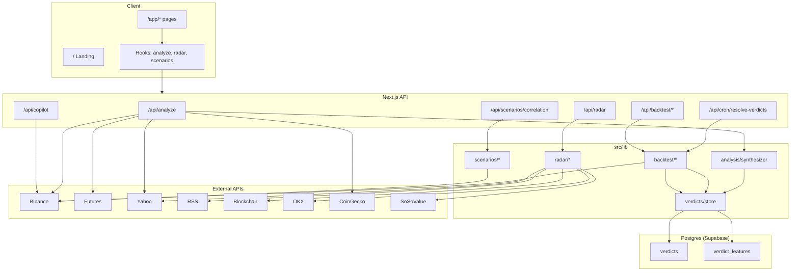
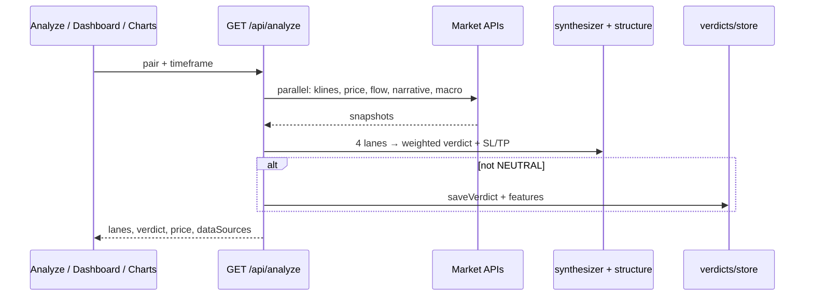

# DeepCurrent — Complete Project Documentation

> Crypto trading intelligence app. Repo / package: **deepcurrent**. UI brand: **Dheerendra Intelligence**.  
> Yeh document poora system explain karta hai — architecture, features, data flow, APIs, setup.

**Related:** [Institutional Radar deep-dive](./INSTITUTIONAL-RADAR.md)

---

## 0. Short summary (Hinglish)

DeepCurrent ek **Next.js** web app hai jo traders ko sirf chart nahi dikhata — **market move ke peeche ka cause** batata hai.

**Kaise kaam karta hai (ek line):**

1. Char independent lanes chalte hain → Technical, Flow, Narrative, Macro  
2. Unke scores ko **weighted synthesis** se ek **Verdict** banaya jata hai (LONG / SHORT / NEUTRAL + SL/TP)  
3. Saath mein Radar (whales/ETF/liquidations/news), Backtest, Scenarios, aur Copilot milte hain  

**Disclaimer:** Informational tool only — financial advice nahi. Pricing / paywall / tokens nahi.

---

## 1. Project kya hai?

### Problem

Traders usually alag-alag sources pe depend karte hain: chart indicators, futures positioning, news/sentiment, macro (DXY/SPX/Gold). Inko manually jodna mushkil hai.

### Solution

DeepCurrent ek hi pipeline mein sab jodta hai:

| Layer | Kya milta hai |
|-------|----------------|
| **Analyze / Charts / Dashboard** | 4-lane analysis + synthesized trade idea |
| **Radar** | Institutional pulse — whales, ETF flows, liquidations, news |
| **Backtest** | Verdicts save → resolve → win rate / equity simulator |
| **Scenarios** | “Agar BTC −10%?” portfolio stress test |
| **Copilot** | Chat UI + live price + LLM (Anthropic) with template fallback |

### Stack

| Layer | Tech |
|--------|------|
| Framework | Next.js **16.2** (App Router) |
| UI | React **19**, Tailwind CSS **4**, Framer Motion, Lucide |
| Charts | `lightweight-charts` (candles), Recharts (equity curve) |
| 3D (landing) | Three.js |
| Database | PostgreSQL (Supabase) via **Prisma 7** + `@prisma/adapter-pg` |
| Optional cache | Upstash Redis (radar) |
| Language | TypeScript |
| Deploy | Vercel (`vercel.json` daily cron fallback + external cron-job.org for frequent runs) |

**Scripts:** `dev`, `build`, `start`, `lint`, `db:generate`, `db:migrate`, `db:push`, `db:studio`, `extract-training-data`.

---

## 2. High-level architecture



### Request lifecycle (Analyze — product ka heart)



---

## 3. Folder structure

```
prisma/
  schema.prisma              → Verdict + VerdictFeature
  migrations/                → SQL migrations (init_verdicts)
prisma.config.ts             → Prisma v7 CLI (DIRECT_URL for migrations)
vercel.json                  → Daily Vercel cron fallback (resolve + generate); frequent schedule via cron-job.org
.env.example                 → Env templates

src/
  generated/prisma/          → Generated Prisma client (do not edit)
  app/
    page.tsx                 → Marketing landing
    layout.tsx               → Root layout (fonts, metadata)
    auth/login|signup        → Mock auth
    privacy|terms            → Legal
    app/                     → Product shell (AppShell)
      dashboard|analyze|charts|backtest|copilot|radar|scenarios|settings
    api/                     → Route handlers
  components/
    landing/                 → Homepage sections (+ Three.js globe)
    app/AppShell.tsx         → Sidebar nav
    charts/                  → Live candles + VerdictCard
    backtest/                → Simulator UI
    scenarios/               → Stress test UI
    radar/                   → useRadarFeed + meta UI
    ui/                      → GlassCard, BiasPill, TierPill, BrandLogo, …
  hooks/
    useLiveAnalysis.ts
    useCorrelationMatrix.ts
  lib/
    analysis/                → 4 lanes + synthesis + structure levels
    backtest/                → Resolve, simulate, track record, lane weights
    radar/                   → News, whales, liquidations, ETF (SoSoValue + fallback)
    scenarios/               → Portfolio stress + correlation
    verdicts/                → Verdict store + ML feature capture
    market/constants.ts      → Tracked pairs + timeframes
    db.ts                    → Lazy Prisma + pg adapter
    binance.ts               → Spot REST + indicators
    binance-futures.ts       → OI, funding, L/S
    macro.ts                 → Yahoo macro
    narrative.ts             → Fear & Greed + CoinGecko
    tradingview.ts           → Chart helpers / pair prefs
    types.ts                 → Shared domain types
  scripts/                   → extract-training-data, debug helpers
docs/
  PROJECT.md                 → Yeh file
  INSTITUTIONAL-RADAR.md     → Radar deep dive
```

Path alias: `@/*` → `./src/*`.

---

## 4. Routes & pages

### Public

| Route | File | Purpose |
|-------|------|---------|
| `/` | `src/app/page.tsx` | Marketing: Hero → EarthRadar → Pipeline → Synthesis → Delivery → CopilotMock → RadarDrawer → ScenarioSimulator → FinalCTA → Footer |
| `/auth/login` | `src/app/auth/login/page.tsx` | Mock sign-in → `/app/dashboard` |
| `/auth/signup` | `src/app/auth/signup/page.tsx` | Mock signup → `/app/dashboard` |
| `/privacy` | `src/app/privacy/page.tsx` | Privacy policy |
| `/terms` | `src/app/terms/page.tsx` | Terms of service |

Root layout (`src/app/layout.tsx`): Inter + JetBrains Mono, dark theme, title **Dheerendra Intelligence**.

### App (`/app/*`)

Wrapped by `src/app/app/layout.tsx` → `AppShell` sidebar (`src/components/app/AppShell.tsx`).

| Route | Purpose |
|-------|---------|
| `/app/dashboard` | Live prices, multi-pair verdicts, news feed |
| `/app/analyze` | Manual 4-lane pipeline runner |
| `/app/charts` | Live candles + side verdict card |
| `/app/backtest` | Track record + equity simulator |
| `/app/copilot` | Chat UI (rule-based replies) |
| `/app/radar` | Whales / ETF / liquidations tables |
| `/app/scenarios` | BTC shock portfolio stress test |
| `/app/settings` | Telegram / watchlist / alerts UI (mostly client-only) |

**Nav order:** Dashboard → Analyze → Charts → Backtest → Copilot → Radar → Scenarios → Settings.

---

## 5. Core engine — 4 Lanes → 1 Verdict

Yeh product ka heart hai. Entry: **`GET /api/analyze`**.

**Files:**
- `src/app/api/analyze/route.ts`
- `src/lib/analysis/synthesizer.ts`
- `src/lib/analysis/structure.ts`
- `src/lib/backtest/lane-weights.ts`

### End-to-end flow

1. Client: `/api/analyze?pair=BTC/USDT&timeframe=1h`
2. Parallel fetch:
   - Binance klines (200 bars) + spot price
   - Binance Futures flow metrics
   - Narrative snapshot
   - Macro snapshot
3. Char lane runners execute
4. `synthesizeVerdict()` weighted score → direction + tier
5. Structure / ATR → SL, TP1, TP2
6. Agar direction `NEUTRAL` nahi → `saveVerdict()` + point-in-time features + cache invalidate
7. JSON: `{ lanes, verdict, price, dataSources }`

### Lane 1 — Technical (`runTechnicalLane`)

| Item | Detail |
|------|--------|
| Data | Candle closes, highs, lows |
| Signals | EMA50, EMA200, RSI(14), swing levels |
| Bias | Price > EMA50 > EMA200 → BULL; opposite → BEAR; mixed otherwise |
| Output | `LaneOutput` with reasoning bullets |

### Lane 2 — Flow (`runFlowLane`)

| Item | Detail |
|------|--------|
| Data | Futures OI Δ%, funding rate, long/short ratio (+ 24h price change) across **Binance + Bybit + OKX** |
| Source | `src/lib/flow/aggregate.ts` → `getFlowMetrics` |
| Note | % metrics averaged; absolute OI prefers Binance; missing venues degrade gracefully |

### Lane 3 — Narrative (`runNarrativeLane`)

| Item | Detail |
|------|--------|
| Data | Fear & Greed, global mcap Δ, 24h price/volume, trending coins |
| Source | `src/lib/narrative.ts` — alternative.me + CoinGecko + Binance |

### Lane 4 — Macro (`runMacroLane`)

| Item | Detail |
|------|--------|
| Data | DXY, S&P 500, Gold daily % |
| Source | `src/lib/macro.ts` — Yahoo Finance |

### Synthesis (`synthesizeVerdict`)

```
laneScore = BIAS_SCORE[bias] × TIER_SCORE[tier]

BIAS:  BULL = +1, BEAR = -1, MIXED = 0
TIER:  HIGH = 3, MODERATE = 2, LOW = 1
```

Weighted average (dynamic lane weights se):

```
normalized = Σ(laneScore × weight) / Σ(weight)
```

| Normalized | Direction | Tier |
|------------|-----------|------|
| `> 0.8` | LONG | `> 1.5` → HIGH, else MODERATE |
| `< -0.8` | SHORT | `< -1.5` → HIGH, else MODERATE |
| otherwise | NEUTRAL | MODERATE |

**Default lane weights** (jab tak ≥30 resolved trades na hoon):

| Lane | Weight |
|------|--------|
| Technical | 0.30 |
| Flow | 0.25 |
| Narrative | 0.25 |
| Macro | 0.20 |

Enough history ke baad weights historical lane accuracy se adjust hote hain.

**Levels** (`structure.ts`):
- ~20-bar swing high/low
- SL structure-anchored, ATR clamp (~0.8×–2.5× ATR)
- TP1 ≈ 2R, TP2 ≈ 3.5R
- Entry = current price
- `riskReward` string e.g. `1:2.0`

**Tracked pairs** (`src/lib/market/constants.ts`): BTC, ETH, SOL, BNB, XRP, PAXG (USDT).  
**Timeframes:** `15m`, `30m`, `1h`, `4h`, `1d`.  
**Dashboard subset:** BTC, ETH, SOL, PAXG.

---

## 6. Features — detail

### 6.1 Dashboard (`/app/dashboard`)

- Tracked pairs ke live prices (`/api/market`)
- Multi-pair analyze / open verdicts overview
- News feed (radar `news` type)
- Quick market + signal snapshot

### 6.2 Analyze (`/app/analyze`)

- User pair + timeframe select karta hai
- Hook: `useLiveAnalysis` → `GET /api/analyze`
- 4 lane cards + final Verdict card
- Same analyze flow Charts ke `VerdictCard` mein reuse

### 6.3 Charts (`/app/charts`)

- `LiveCandleChart`: pehle REST `/api/klines`, phir Binance WebSocket live updates
- Side pe live verdict + price poll
- Selected pair: `localStorage` key `dc_selected_pair` (`tradingview.ts`)

### 6.4 Radar (`/app/radar` + landing drawer)

**Full detail:** [`docs/INSTITUTIONAL-RADAR.md`](./INSTITUTIONAL-RADAR.md)

**API:** `GET /api/radar?type=news|whales|liquidations|etf`

Response: `{ type, data, source, cached, fetchedAt }`.

| Type | Source | Cache TTL |
|------|--------|-----------|
| `news` | CoinDesk / CoinTelegraph / Decrypt RSS + keyword sentiment | ~60s |
| `whales` | Blockchair BTC/ETH + Solana RPC (size thresholds) | ~120s |
| `liquidations` | OKX REST + Binance/Bybit WebSocket (BTC/ETH/SOL) | ~30s |
| `etf` | SoSoValue real net flows (`SOSOVALUE_API_KEY`) → fallback Yahoo proxy | ~300s |

Cache: Upstash Redis (optional) ya in-memory fallback.

Hook: `src/components/radar/useRadarFeed.ts`.  
Libs: `src/lib/radar/` — `whales.ts`, `etf-flows.ts`, `liquidations.ts`, `providers/sosovalue.ts`, `utils.ts`, `format.ts`.

### 6.5 Backtest (`/app/backtest`)

Teen-step pipeline:

1. **Persist** — non-neutral analyze verdicts → Postgres (ya memory) + `verdict_features`
   - Manual: user visits `/app/analyze`
   - Auto: cron `GET|POST /api/cron/generate-verdicts` (all tracked pairs × timeframes)
2. **Resolve** — cron `GET|POST /api/cron/resolve-verdicts`
   - Open verdicts pe klines replay
   - Outcomes: `tp1_hit` / `tp2_hit` / `sl_hit` / `expired`
   - Min age ~5m, max hold ~48h
   - Optional auth: `Authorization: Bearer CRON_SECRET`
3. **Report**
   - `GET /api/backtest/track-record` → win rate, tier WR, lane accuracy
   - `POST /api/backtest/simulate` → capital, risk%, date range → equity curve + trades

**Cron schedules (dual setup — do not assume Vercel alone is enough):**
- **Primary (frequent):** cron-job.org → resolve every 15m, generate every 30m
- **Fallback (Hobby daily only):** `vercel.json` → resolve `0 0 * * *`, generate `0 1 * * *`
- See README “Cron scheduling” for URL / header details. Both paths are idempotent.

**Libs:** `simulator.ts`, `resolver.ts`, `aggregator.ts`, `cache.ts`, `lane-weights.ts`  
**UI:** `TrackRecordSummary`, `SimulatorPanel`, `EquityCurveChart`  
**Minimum trades:** `MIN_SIM_TRADES` (5)

**Caveat:** Bina `DATABASE_URL` ke verdict store **process memory** hai — restart pe data lose. Postgres set hone par durable.

**ML extract:** `npm run extract-training-data` → resolved verdicts + features → CSV (`scripts/extract-training-data.ts`).

### 6.6 Scenarios (`/app/scenarios`)

1. Positions `localStorage` (`dc_portfolio_positions`) mein
2. Mark prices `/api/market` se refresh
3. Correlation: Binance 1h klines, Pearson β vs BTC (`/api/scenarios/correlation`)
4. User BTC shock % set karta hai
5. `stressPortfolio()` → shocked price, PnL, stop-hit, funding/OI cascade
6. Optional: open verdicts import → risk-sized positions (`verdict-import.ts`)

**Libs:** `stress.ts`, `correlation.ts`, `positions-store.ts`, `mark-prices.ts`, `verdict-import.ts`  
**Hook:** `useScenarioPortfolio`  
**UI:** `ScenarioStressPanel`, `PositionControls`

### 6.7 Copilot (`/app/copilot`)

- Model dropdown maps to Anthropic Claude (Sonnet)
- `POST /api/copilot` `{ message, model? }`
- Message se symbol extract (BTC/ETH/SOL/BNB/XRP/PAXG, default BTC)
- Live price + 24h ticker + open verdicts + news headlines as context
- `GEMINI_API_KEY` (free, preferred) ya `ANTHROPIC_API_KEY` → real LLM; warna **template fallback**
- Default model: Gemini 2.5 Flash; Claude optional when Anthropic key set

### 6.8 Settings (`/app/settings`)

- Telegram chat id + test alert
- Alert prefs: enabled, minTier, watchlist, radar spike toggles
- Persisted via `/api/settings` (Upstash Redis or in-memory)
- Env fallbacks: `TELEGRAM_BOT_TOKEN`, `TELEGRAM_CHAT_ID`

### 6.9 Auth — mock

- Login/signup: `localStorage.setItem("dc_auth", JSON.stringify({ email }))`
- Password validate / store nahi hota
- **No** `middleware.ts`, sessions, cookies, DB User model
- `/app/*` routes **ungated** hain
- Sign out = link to `/auth/login` (AppShell `dc_auth` clear nahi karta)

---

## 7. API reference

| Method | Path | Input | Output / role |
|--------|------|-------|----------------|
| GET | `/api/analyze` | `pair`, `timeframe` | `{ lanes, verdict, price, dataSources }` |
| GET | `/api/market` | `symbol` | `{ symbol, price }` |
| GET | `/api/klines` | `symbol`, `interval`, `limit` (max 500) | `{ candles: [{ time, open, high, low, close }] }` |
| POST | `/api/copilot` | `{ message }` | `{ reply, symbol, price }` |
| GET | `/api/radar` | `type` | `{ type, data, source, cached, fetchedAt }` |
| POST | `/api/backtest/simulate` | pair, dateRange, capital, risk, minTier… | Equity curve + trades + metrics |
| GET | `/api/backtest/track-record` | — | Aggregate WR, lane accuracy, etc. |
| GET | `/api/scenarios/correlation` | — | `{ matrix, cached, source }` |
| GET | `/api/verdicts/open` | — | `{ verdicts, count }` |
| GET/POST | `/api/cron/resolve-verdicts` | Bearer secret (optional) | Resolve open verdicts |
| GET/POST | `/api/cron/generate-verdicts` | Bearer secret (optional) | Auto-analyze all tracked pairs × TFs |
| GET/POST | `/api/cron/check-alerts` | Bearer secret (optional) | Radar spike → Telegram |
| GET/PUT | `/api/settings` | prefs JSON | Alert preferences |
| POST | `/api/settings/test-telegram` | — | Send test Telegram message |
| GET | `/api/health` | — | DB / backtest / env presence snapshot |

### Analyze `dataSources` example

```ts
{
  klines: "binance",
  price: "binance",
  flow: "binance+bybit+okx" | "binance" | "unavailable",
  narrative: "alternative.me+coingecko+binance" | "unavailable",
  macro: "yahoo-finance" | "unavailable",
  stopLoss: "swing-structure",
}
```

---

## 8. Key hooks

| Hook | File | Behavior |
|------|------|----------|
| `useLiveAnalysis(pair, timeframe)` | `src/hooks/useLiveAnalysis.ts` | Fetches `/api/analyze` once per pair/TF |
| `useRadarFeed(type, pollMs)` | `src/components/radar/useRadarFeed.ts` | Polls `/api/radar` |
| `useCorrelationMatrix()` | `src/hooks/useCorrelationMatrix.ts` | One-shot correlation fetch |
| `useScenarioPortfolio(enabled)` | `src/components/scenarios/useScenarioPortfolio.ts` | Hydrate/persist positions, marks, import verdicts |

---

## 9. External data sources

| Source | Used for |
|--------|----------|
| Binance Spot REST | Price, klines, 24h ticker |
| Binance WebSocket | Live chart candles |
| Binance Futures | OI, funding, long/short (primary flow venue) |
| Bybit / OKX | Additional OI + funding (+ L/S) averaged into Flow lane |
| CoinGecko | Price fallback; narrative global/trending |
| alternative.me | Fear & Greed index |
| Yahoo Finance | Macro (DXY / SPX / Gold); ETF activity proxy |
| CoinDesk / CoinTelegraph / Decrypt RSS | News headlines |
| Blockchair (+ helpers) | Whale transactions |
| Solana public RPC | SOL whales |
| OKX / Binance / Bybit | Liquidations |
| SoSoValue OpenAPI | Real ETF net flows (optional key) |
| Upstash Redis | Durable radar cache (optional) |

### Environment variables

| Variable | Role |
|----------|------|
| `DATABASE_URL` | App runtime Postgres (Supabase transaction pooler, typically port **6543**) |
| `DIRECT_URL` | Prisma migrations (session pooler, typically port **5432**) |
| `CRON_SECRET` | Optional bearer auth for resolve cron |
| `SOSOVALUE_API_KEY` | Real ETF net flows |
| `UPSTASH_REDIS_REST_URL` / `UPSTASH_REDIS_REST_TOKEN` | Radar cache |
| `GEMINI_API_KEY` | Free Copilot LLM via Google AI Studio (preferred) |
| `ANTHROPIC_API_KEY` | Paid Copilot LLM fallback (Claude) |
| `TELEGRAM_BOT_TOKEN` | Telegram Bot API token for alerts |
| `TELEGRAM_CHAT_ID` | Default chat id (Settings can override) |

Templates: `.env.example`.

---

## 10. Storage map

| Data | Where | Durable? |
|------|--------|----------|
| Verdicts / backtest history | Postgres via Prisma when `DATABASE_URL` set; else in-memory | Yes with DB; no without |
| Point-in-time lane features | `verdict_features` (or memory) | Same as verdicts |
| Radar / track-record caches | Upstash or in-memory Map + TTL | Redis yes / memory no |
| Auth stub | `localStorage` `dc_auth` | Browser only |
| Chart pair | `localStorage` `dc_selected_pair` | Browser |
| Scenario portfolio | `localStorage` `dc_portfolio_positions` | Browser |
| Alert prefs | Upstash / in-memory (`alerts:prefs`) | Redis yes / memory no |

### Database schema (Prisma)

| Model / table | Purpose |
|---------------|---------|
| `Verdict` → `verdicts` | Trade idea: pair, direction, tier, entry/SL/TP, lane biases, outcome |
| `VerdictFeature` → `verdict_features` | Point-in-time raw lane numerics (ML); 1:1 with verdict |

**Runtime:** `src/lib/db.ts` → lazy `PrismaClient` + `PrismaPg` on `DATABASE_URL`.  
**Store:** `src/lib/verdicts/store.ts` — `"postgres"` | `"memory"` via `getVerdictStoreMode()`.  
**Outcomes:** `tp1_hit` | `tp2_hit` | `sl_hit` | `expired` | `open`.

---

## 11. Domain types

Shared in `src/lib/types.ts`:

| Type | Role |
|------|------|
| `Bias` | `BULL` \| `BEAR` \| `MIXED` |
| `Tier` | `HIGH` \| `MODERATE` \| `LOW` |
| `Direction` | `LONG` \| `SHORT` \| `NEUTRAL` |
| `LaneOutput` | Lane result: badge, bias, tier, reasoning |
| `Verdict` | Final trade idea: levels, R:R, rationale |
| Radar DTOs | `NewsItem`, `WhaleTransaction`, `ETFFlow`, `Liquidation` |
| Scenario DTOs | `PortfolioPosition`, `PositionStressResult`, `PortfolioStressResult` |

Persisted: `StoredVerdict`, feature payloads in `src/lib/verdicts/`.

---

## 12. UI / design system

### Theme (`src/app/globals.css`)

Dark navy palette via CSS variables → Tailwind `@theme`:

| Token | Role |
|-------|------|
| `--bg-primary` `#03060f` | Page background |
| `--bg-secondary` `#080c1a` | Shell / panels |
| `--bg-card` `#0d1224` | Cards |
| `--bull` / `--bear` / `--mixed` / `--accent` | Signal colors |
| Fonts | Inter (sans), JetBrains Mono (data) |

Utilities: `.glass-card`, glow / pulse helpers.

### Shared components

| Area | Components |
|------|------------|
| Shell | `AppShell`, `BrandLogo` |
| Charts | `LiveCandleChart`, `VerdictCard` |
| Backtest | `TrackRecordSummary`, `SimulatorPanel`, `EquityCurveChart` |
| Scenarios | `ScenarioStressPanel`, `PositionControls` |
| Shared UI | `GlassCard`, `BiasPill`, `TierPill`, `CoinIcon`, `ScrollReveal` |
| Landing | `Hero`, `EarthRadar`/`GlobeScene`, `Pipeline`, `Synthesis`, `Delivery`, `CopilotMock`, `RadarDrawer`, `ScenarioSimulator`, `FinalCTA`, `Footer`, `ProgressRail` |

No shadcn / Redux — domain logic `src/lib/` mein, UI `src/components/` mein.

---

## 13. Local development

```bash
npm install
cp .env.example .env          # fill DATABASE_URL + DIRECT_URL (Supabase)
npm run db:migrate            # apply Prisma migrations (uses DIRECT_URL)
npm run dev                   # http://localhost:3000
```

| Script | Purpose |
|--------|---------|
| `npm run db:generate` | Regenerate Prisma client → `src/generated/prisma` |
| `npm run db:migrate` | Create / apply migrations |
| `npm run db:push` | Push schema without migration file |
| `npm run db:studio` | Browse tables in browser |
| `npm run extract-training-data` | ML CSV from resolved verdicts |
| `npm run build` | `prisma generate && next build` |
| `npm run lint` | ESLint |

**Supabase + Prisma v7:**
- Runtime: `DATABASE_URL` (6543, pgbouncer) in `src/lib/db.ts`
- CLI: `DIRECT_URL` (5432) via `prisma.config.ts` — sirf 6543 se migrations hang ho sakti hain

Bina real `DATABASE_URL` ke app chalega; verdicts memory mein rahenge (restart pe lose).

**Check paths:** `/` · `/app/dashboard` · `/app/analyze` · `/app/charts` · `/app/radar` · `/app/backtest` · `/app/scenarios` · `/app/copilot`

---

## 14. Known limitations

1. **Auth is mock** — routes unprotected; no User table / sessions (intentional for solo use)
2. **Copilot needs `GEMINI_API_KEY` (free) or `ANTHROPIC_API_KEY`** — without either, keyword templates still work
3. **Memory fallback without DB / Redis** — backtest history + alert prefs ephemeral on restart
4. **ETF flows** — SoSoValue jab key ho; warna Yahoo **proxy**, issuer flow data nahi  
5. **Branding mix** — package `deepcurrent`, UI “Dheerendra Intelligence”  
6. **Supabase dual URL** — runtime 6543 vs migrate 5432  
7. **Cron** — Vercel pe **daily** fallback; dense schedule via GitHub Actions / cron-job.org (`docs/CRON.md`)  
8. **Telegram** — needs bot token + chat id; no BotFather deep-link OAuth flow

---

## 15. Quick map — “kaunsi functionality kahan”

| User goal | UI | API | Lib |
|-----------|-----|-----|-----|
| 4-lane signal | Analyze / Charts / Dashboard | `/api/analyze` | `analysis/synthesizer` |
| Live candles | Charts | `/api/klines` + Binance WS | `binance`, `tradingview` |
| Market pulse | Radar | `/api/radar` | `radar/*` |
| Historical edge | Backtest | `/api/backtest/*` + cron | `backtest/*`, `verdicts/*` |
| “Agar BTC −10%?” | Scenarios | `/api/scenarios/correlation`, `/api/market` | `scenarios/*` |
| Ask a question | Copilot | `/api/copilot` | Anthropic LLM + template fallback |
| Alerts | Settings | `/api/settings`, `/api/cron/check-alerts` | `alerts/*` + Telegram |
| Sign in | Auth pages | — | `localStorage` only |

---

## 16. Docs index

| Doc | Content |
|-----|---------|
| [`docs/PROJECT.md`](./PROJECT.md) | Poori architecture + features (yeh file) |
| [`docs/INSTITUTIONAL-RADAR.md`](./INSTITUTIONAL-RADAR.md) | Radar sources, cache, thresholds |
| [`docs/CRON.md`](./CRON.md) | Frequent cron (GitHub Actions / cron-job.org) |
| [`README.md`](../README.md) | Quick start |
| [`.env.example`](../.env.example) | Env var templates |

---

*Last updated from the working tree. Jab APIs, storage, lane logic, ya cron change ho — is file ko sync rakho.*
