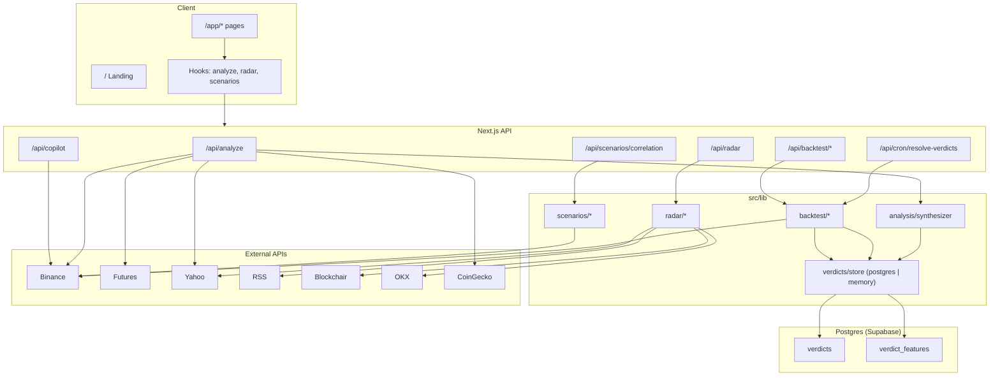

# DeepCurrent — Project Documentation

> Crypto trading intelligence app. Repo name: **deepcurrent**. UI brand: **Dheerendra Intelligence**.

---

## 1. Project kya hai?

DeepCurrent ek **Next.js** app hai jo traders ko sirf price chart nahi, balki **market move ke peeche ka cause** dikhata hai.

**Core idea:**
- Char independent analysis lanes chalao (Technical, Flow, Narrative, Macro)
- Unko **ek synthesized verdict** mein jodo — direction, confidence tier, entry / stop-loss / take-profit
- Saath mein Radar, Backtest, Scenarios, aur Copilot do
- Pricing / paywall / tokens nahi

**Disclaimer:** Informational tool only — financial advice nahi.

### Stack

| Layer | Tech |
|--------|------|
| Framework | Next.js 16 (App Router) |
| UI | React 19, Tailwind CSS 4, Framer Motion, Lucide |
| Charts | lightweight-charts, Recharts |
| 3D (landing) | Three.js |
| Database | PostgreSQL (Supabase) via Prisma 7 + `@prisma/adapter-pg` |
| Language | TypeScript |

Scripts (`package.json`): `dev`, `build`, `start`, `lint`, `db:generate`, `db:migrate`, `db:push`, `db:studio`.

---

## 2. High-level architecture



---

## 3. Folder structure

```
prisma/
  schema.prisma            → Verdict + VerdictFeature models
  migrations/              → Applied SQL migrations (e.g. init_verdicts)
prisma.config.ts           → Prisma v7 CLI config (DIRECT_URL for migrations)

src/
  generated/prisma/        → Prisma client (generated; do not edit)
  app/
    page.tsx                 → Marketing landing
    layout.tsx               → Root layout (fonts, metadata)
    auth/login|signup        → Mock auth
    privacy|terms            → Legal pages
    app/                     → Product shell (AppShell)
      dashboard|analyze|charts|backtest|copilot|radar|scenarios|settings
    api/                     → Route handlers
  components/
    landing/                 → Homepage sections
    app/AppShell.tsx         → Sidebar nav
    charts/                  → Live candles + VerdictCard
    backtest/                → Simulator UI
    scenarios/               → Stress test UI
    radar/                   → useRadarFeed hook
    ui/                      → GlassCard, BiasPill, TierPill, etc.
  hooks/
    useLiveAnalysis.ts
    useCorrelationMatrix.ts
  lib/
    analysis/                → 4 lanes + synthesis + structure levels
    backtest/                → Resolve, simulate, track record, weights
    radar/                   → News, whales, liquidations, ETF proxy
    scenarios/               → Portfolio stress + correlation
    verdicts/                → Verdict store + ML feature capture
    db.ts                    → Prisma client (lazy; pg adapter)
    binance.ts               → Spot REST + indicators
    binance-futures.ts       → OI, funding, L/S
    macro.ts                 → Yahoo macro snapshots
    narrative.ts             → Fear & Greed + CoinGecko narrative
    tradingview.ts           → Chart helpers / pair prefs
    market/constants.ts      → Tracked pairs
    types.ts                 → Shared domain types
    fetch-utils.ts           → Timed fetch helper
```

---

## 4. Routes & pages

### Public

| Route | File | Purpose |
|-------|------|---------|
| `/` | `src/app/page.tsx` | Marketing: Hero → EarthRadar → Pipeline → Synthesis → Delivery → CopilotMock → RadarDrawer → ScenarioSimulator → FinalCTA → Footer |
| `/auth/login` | `src/app/auth/login/page.tsx` | Mock sign-in → `/app/dashboard` |
| `/auth/signup` | `src/app/auth/signup/page.tsx` | Mock signup → `/app/dashboard` |
| `/privacy` | `src/app/privacy/page.tsx` | Privacy policy |
| `/terms` | `src/app/terms/page.tsx` | Terms of service |

### App (`/app/*`)

Wrapped by `src/app/app/layout.tsx` → `AppShell` sidebar. Nav defined in `src/components/app/AppShell.tsx`.

| Route | Purpose |
|-------|---------|
| `/app/dashboard` | Live prices, multi-pair verdicts, news feed |
| `/app/analyze` | Manual 4-lane pipeline runner |
| `/app/charts` | Live candles + side verdict card |
| `/app/backtest` | Track record + equity simulator |
| `/app/copilot` | Chat UI (rule-based replies) |
| `/app/radar` | Whales / ETF / liquidations tables |
| `/app/scenarios` | BTC shock portfolio stress test |
| `/app/settings` | Telegram / watchlist / alerts UI (mostly client-only) |

---

## 5. Core engine — 4 Lanes → 1 Verdict

Yeh product ka heart hai. Entry: **`GET /api/analyze`**.

**Files:**
- `src/app/api/analyze/route.ts`
- `src/lib/analysis/synthesizer.ts`
- `src/lib/analysis/structure.ts`

### End-to-end flow

1. Client call: `/api/analyze?pair=BTC/USDT&timeframe=1h`
2. Parallel fetch:
   - Binance klines (200 bars) + spot price
   - Binance Futures flow metrics
   - Narrative snapshot
   - Macro snapshot
3. Char lane runners execute
4. `synthesizeVerdict()` weighted score → direction + tier
5. Structure / ATR → SL, TP1, TP2
6. Agar direction `NEUTRAL` nahi → `saveVerdict()` + point-in-time features + cache invalidate
7. JSON response: `{ lanes, verdict, price, dataSources }`

### Lane 1 — Technical (`runTechnicalLane`)

| Item | Detail |
|------|--------|
| Data | Candle closes, highs, lows |
| Signals | EMA50, EMA200, RSI(14), swing levels |
| Bias | Price > EMA50 > EMA200 → BULL; opposite → BEAR; mixed otherwise |
| Output | `LaneOutput` with reasoning bullets |

### Lane 2 — Flow (`runFlowLane`)

| Item | Detail |
|------|--------|
| Data | Futures OI Δ%, funding rate, long/short ratio (+ 24h price change) |
| Source | `src/lib/binance-futures.ts` → `getFlowMetrics` |
| Note | Futures unavailable hone par lane gracefully degrade karti hai |

### Lane 3 — Narrative (`runNarrativeLane`)

| Item | Detail |
|------|--------|
| Data | Fear & Greed, global mcap Δ, 24h price/volume, trending coins |
| Source | `src/lib/narrative.ts` — alternative.me + CoinGecko + Binance |

### Lane 4 — Macro (`runMacroLane`)

| Item | Detail |
|------|--------|
| Data | DXY, S&P 500, Gold daily % |
| Source | `src/lib/macro.ts` — Yahoo Finance |

### Synthesis (`synthesizeVerdict`)

Har lane ka score:

```
laneScore = BIAS_SCORE[bias] × TIER_SCORE[tier]

BIAS:  BULL = +1, BEAR = -1, MIXED = 0
TIER:  HIGH = 3, MODERATE = 2, LOW = 1
```

Weighted average (dynamic lane weights se):

```
normalized = Σ(laneScore × weight) / Σ(weight)
```

| Normalized | Direction | Tier |
|------------|-----------|------|
| `> 0.8` | LONG | `> 1.5` → HIGH, else MODERATE |
| `< -0.8` | SHORT | `< -1.5` → HIGH, else MODERATE |
| otherwise | NEUTRAL | MODERATE |

**Levels** (`structure.ts`):
- ~20-bar swing high/low
- SL structure-anchored, ATR clamp (~0.8×–2.5× ATR)
- TP1 ≈ 2R, TP2 ≈ 3.5R
- Entry = current price
- `riskReward` string e.g. `1:2.0`

**Lane weights** (`src/lib/backtest/lane-weights.ts`):
- Default ≈ equal (0.25 each)
- Jab enough resolved trades (≥30) ho jaayein → historical lane accuracy se weights adjust

---

## 6. Features — detail

### 6.1 Dashboard (`/app/dashboard`)

- Tracked pairs ke live prices (`/api/market`)
- Analyze / open verdicts overview
- News feed (radar `news` type)
- Quick market + signal snapshot

### 6.2 Analyze (`/app/analyze`)

- User pair + timeframe select karta hai
- Hook: `useLiveAnalysis` → `GET /api/analyze`
- 4 lane cards + final Verdict card
- Same analyze flow Charts ke `VerdictCard` mein reuse

### 6.3 Charts (`/app/charts`)

- `LiveCandleChart`: pehle REST `/api/klines`, phir Binance WebSocket live updates
- Side pe live verdict + price poll
- Selected pair preference: `localStorage` key `dc_selected_pair` (`tradingview.ts`)

### 6.4 Radar (`/app/radar` + landing drawer)

**API:** `GET /api/radar?type=news|whales|liquidations|etf`

| Type | Source | Cache TTL (approx) |
|------|--------|--------------------|
| `news` | CoinDesk / CoinTelegraph / Decrypt RSS + keyword sentiment | ~60s |
| `whales` | Blockchair BTC (≥50) / ETH (≥500) txs + Binance USD | ~120s |
| `liquidations` | OKX public liquidation orders (BTC/ETH/SOL) | ~30s |
| `etf` | Yahoo charts IBIT/FBTC/GBTC/ARKB/ETHA — **proxy** (`volume × price × %change`), true issuer flows nahi | ~300s |

Hook: `src/components/radar/useRadarFeed.ts` — poll + manual refresh.

Libs: `src/lib/radar/news.ts`, `whales.ts`, `liquidations.ts`, `etf-flows.ts`, `utils.ts`.

### 6.5 Backtest (`/app/backtest`)

Teen-step pipeline:

1. **Persist** — analyze non-neutral verdicts ko Postgres (ya memory fallback) mein save (`saveVerdict`); saath mein `verdict_features` row for ML training
2. **Resolve** — cron `GET|POST /api/cron/resolve-verdicts` (~15 min via `vercel.json`)
   - Open verdicts pe klines replay
   - Outcomes: `tp1_hit` / `tp2_hit` / `sl_hit` / `expired`
   - Min age ~5m, max hold ~48h
   - Optional auth: `Authorization: Bearer CRON_SECRET`
3. **Report**
   - `GET /api/backtest/track-record` → win rate, tier WR, lane accuracy
   - `POST /api/backtest/simulate` → capital, risk%, date range → equity curve + trades

**Libs:** `simulator.ts`, `resolver.ts`, `aggregator.ts`, `cache.ts`, `lane-weights.ts`

**UI:** `TrackRecordSummary`, `SimulatorPanel`, `EquityCurveChart`

**Minimum trades:** `MIN_SIM_TRADES` (5) — simulator ko meaningful sample chahiye.

**Caveat:** Bina `DATABASE_URL` ke verdict store **process memory** hai — restart / cold start pe data lose ho sakta hai. Supabase Postgres set hone par verdicts + features durable rehte hain.

### 6.6 Scenarios (`/app/scenarios`)

1. Positions `localStorage` (`dc_portfolio_positions`) mein
2. Mark prices `/api/market` se refresh
3. Correlation: Binance 1h klines, Pearson β vs BTC (`/api/scenarios/correlation`)
4. User BTC shock % set karta hai
5. `stressPortfolio()` → shocked price, PnL, stop-hit, funding/OI cascade
6. Optional: open verdicts import → risk-sized positions (`verdict-import.ts`)

**Libs:** `stress.ts`, `correlation.ts`, `positions-store.ts`, `mark-prices.ts`, `verdict-import.ts`  
**Hook:** `useScenarioPortfolio`  
**UI:** `ScenarioStressPanel`, `PositionControls`

### 6.7 Copilot (`/app/copilot`)

- UI model dropdown **cosmetic** (server ignore karta hai)
- `POST /api/copilot` `{ message }`
- Message se symbol extract (BTC/ETH/SOL/BNB/XRP/PAXG, default BTC)
- Live price + 24h ticker
- `generateReply()` — **keyword / template replies**, real LLM nahi

### 6.8 Settings (`/app/settings`)

- Telegram link / watchlist / alerts UI
- Mostly React state; Telegram link cosmetic
- Durable backend persist nahi

### 6.9 Auth — mock

- Login/signup: `localStorage.setItem("dc_auth", JSON.stringify({ email }))`
- Password validate / store nahi hota
- No middleware, sessions, cookies, DB auth
- `/app/*` routes **ungated** hain
- Sign out sirf `/auth/login` pe link

---

## 7. API reference

| Method | Path | Input | Output / role |
|--------|------|-------|----------------|
| GET | `/api/analyze` | `pair`, `timeframe` | `{ lanes, verdict, price, dataSources }` |
| GET | `/api/market` | `symbol` | `{ symbol, price }` |
| GET | `/api/klines` | `symbol`, `interval`, `limit` (max 500) | `{ candles: [{ time, open, high, low, close }] }` |
| POST | `/api/copilot` | `{ message }` | `{ reply, symbol, price }` |
| GET | `/api/radar` | `type` | `{ type, data, cached, source? }` |
| POST | `/api/backtest/simulate` | pair, dateRange, capital, risk, minTier… | Equity curve + trades + metrics |
| GET | `/api/backtest/track-record` | — | Aggregate WR, lane accuracy, etc. |
| GET | `/api/scenarios/correlation` | — | `{ matrix, cached, source }` |
| GET | `/api/verdicts/open` | — | `{ verdicts, count }` |
| GET/POST | `/api/cron/resolve-verdicts` | Bearer secret (optional) | Resolve open verdicts |

---

## 8. Key hooks

| Hook | File | Behavior |
|------|------|----------|
| `useLiveAnalysis(pair, timeframe)` | `src/hooks/useLiveAnalysis.ts` | Fetches `/api/analyze` once per pair/TF |
| `useRadarFeed(type, pollMs)` | `src/components/radar/useRadarFeed.ts` | Polls `/api/radar` |
| `useCorrelationMatrix()` | `src/hooks/useCorrelationMatrix.ts` | One-shot correlation fetch |
| `useScenarioPortfolio(enabled)` | `src/components/scenarios/useScenarioPortfolio.ts` | Hydrate/persist positions, marks, import verdicts |

---

## 9. External data sources

| Source | Used for |
|--------|----------|
| Binance Spot REST (`data-api.binance.vision`, `api.binance.com`) | Price, klines, 24h ticker |
| Binance WebSocket | Live chart candles |
| Binance Futures (`fapi.binance.com`) | OI, funding, long/short |
| CoinGecko | Price fallback; narrative global/trending |
| alternative.me | Fear & Greed index |
| Yahoo Finance | Macro (DXY / SPX / Gold); ETF activity proxy |
| CoinDesk / CoinTelegraph / Decrypt RSS | News headlines |
| Blockchair | Whale transactions |
| OKX public API | Liquidations |

**Optional env** (README / future; core path mostly without LLM):
- `DATABASE_URL` — Supabase transaction pooler (port 6543) for app runtime
- `DIRECT_URL` — Supabase session pooler (port 5432) for Prisma migrations
- `CRON_SECRET`
- `ANTHROPIC_API_KEY`
- `TELEGRAM_BOT_TOKEN`

---

## 10. Storage map

| Data | Where | Durable? |
|------|--------|----------|
| Verdicts / backtest history | Postgres via Prisma when `DATABASE_URL` set; else in-memory (`src/lib/verdicts/store.ts`) | Yes with DB; no without |
| Point-in-time lane features | `verdict_features` table (or memory alongside verdict) | Same as verdicts |
| Radar / track-record caches | In-memory Map + TTL | No |
| Auth stub | `localStorage` `dc_auth` | Browser only |
| Chart pair | `localStorage` `dc_selected_pair` | Browser |
| Scenario portfolio | `localStorage` `dc_portfolio_positions` | Browser |
| Settings alerts | React `useState` | Not persisted |
| Prisma schema / migrations | `prisma/`, `prisma.config.ts` | Yes (repo) |
| Postgres tables | Supabase `verdicts`, `verdict_features` | Yes (when `DATABASE_URL` set) |

### Database schema (Prisma)

Configured in `prisma/schema.prisma`; connection URLs in `prisma.config.ts` (Prisma v7).

| Model / table | Purpose |
|---------------|---------|
| `Verdict` → `verdicts` | Trade idea: pair, direction, tier, entry/SL/TP, lane biases, outcome fields |
| `VerdictFeature` → `verdict_features` | Point-in-time raw lane numerics at verdict creation (ML training); 1:1 with verdict |

**Runtime path:** `src/lib/db.ts` → lazy `PrismaClient` + `PrismaPg` adapter on `DATABASE_URL`.  
**Store:** `src/lib/verdicts/store.ts` — Postgres when configured, else in-memory array.  
**Feature capture:** `src/lib/verdicts/features.ts` + `buildVerdictFeatures()` in `/api/analyze`.

---

## 11. Domain types

Shared in `src/lib/types.ts`:

| Type | Role |
|------|------|
| `Bias` | `BULL` \| `BEAR` \| `MIXED` |
| `Tier` | `HIGH` \| `MODERATE` \| `LOW` |
| `Direction` | `LONG` \| `SHORT` \| `NEUTRAL` |
| `LaneOutput` | Lane result: badge, bias, tier, reasoning |
| `Verdict` | Final trade idea: levels, R:R, rationale |
| `NewsItem` / `WhaleTransaction` / `ETFFlow` / `Liquidation` | Radar payloads |
| `PortfolioPosition` / `PositionStressResult` / `PortfolioStressResult` | Scenario stress |

Persisted shape: `StoredVerdict`, `VerdictFeaturePayload` in `src/lib/verdicts/types.ts` and `features.ts`.

---

## 12. UI components map

### Landing (`src/components/landing/`)

`Hero`, `EarthRadar` (+ `GlobeScene`), `Pipeline`, `Synthesis`, `Delivery`, `CopilotMock`, `RadarDrawer`, `ScenarioSimulator`, `FinalCTA`, `Footer`, `ProgressRail`

### App / feature

| Area | Components |
|------|------------|
| Shell | `AppShell` |
| Charts | `LiveCandleChart`, `VerdictCard` |
| Backtest | `TrackRecordSummary`, `SimulatorPanel`, `EquityCurveChart` |
| Scenarios | `ScenarioStressPanel`, `PositionControls` |
| Shared UI | `GlassCard`, `BiasPill`, `TierPill`, `CoinIcon`, `ScrollReveal` |

---

## 13. Local development

```bash
npm install
cp .env.example .env          # fill DATABASE_URL + DIRECT_URL (Supabase)
npm run db:migrate            # apply Prisma migrations (uses DIRECT_URL)
npm run dev                   # http://localhost:3000
npm run build
npm run start
npm run lint
```

**Database commands:**

| Script | Command | Purpose |
|--------|---------|---------|
| `db:generate` | `prisma generate` | Regenerate client → `src/generated/prisma` |
| `db:migrate` | `prisma migrate dev` | Create / apply migrations |
| `db:push` | `prisma db push` | Push schema without migration file |
| `db:studio` | `prisma studio` | Browse tables in browser |

**Supabase + Prisma v7 notes:**
- App runtime connects via `DATABASE_URL` (6543, pgbouncer) in `src/lib/db.ts`
- Prisma CLI uses `DIRECT_URL` (5432) via `prisma.config.ts` — port 6543 par migrations hang ho sakti hain
- `getVerdictStoreMode()` returns `"postgres"` or `"memory"` depending on env

Typical check paths:
- Landing: `/`
- App: `/app/dashboard`, `/app/analyze`, `/app/charts`, `/app/radar`, `/app/backtest`, `/app/scenarios`, `/app/copilot`

---

## 14. Known limitations

1. **Memory fallback without DB** — `DATABASE_URL` na ho to verdicts ephemeral rehte hain; production backtest ke liye Postgres configure karna chahiye
2. **Copilot is not an LLM** — keyword templates; model picker cosmetic
3. **ETF “flows” are a proxy** — volume × price × direction, not issuer flow data
4. **Auth is mock** — demo UX only; routes not protected
5. **Branding mix** — package/repo `deepcurrent`, UI “Dheerendra Intelligence”
6. **Supabase pooler split** — migrations ko `DIRECT_URL` (5432) chahiye; sirf transaction pooler (6543) se CLI hang ho sakti hai

---

## 15. Quick “kaunsi functionality kahan”

| User goal | UI | API | Lib |
|-----------|-----|-----|-----|
| 4-lane signal | Analyze / Charts / Dashboard | `/api/analyze` | `analysis/synthesizer` |
| Live candles | Charts | `/api/klines` + Binance WS | `binance`, `tradingview` |
| Market pulse | Radar | `/api/radar` | `radar/*` |
| Historical edge | Backtest | `/api/backtest/*` + cron | `backtest/*`, `verdicts/store`, `verdicts/features` |
| “Agar BTC -10%?” | Scenarios | `/api/scenarios/correlation`, `/api/market` | `scenarios/*` |
| Ask a question | Copilot | `/api/copilot` | keyword `generateReply` |
| Sign in | Auth pages | — | `localStorage` only |

---

*Last documented from the working tree architecture. Update this file when APIs, storage, or lane logic change.*
